# Swift Day 16
> 项目实践:今天有三个主题,主要使用到viewController storyboards 和 FileManager

### Setting up

1. 启动Xcode -> `Create a new Xcode project` -> `Single View App`
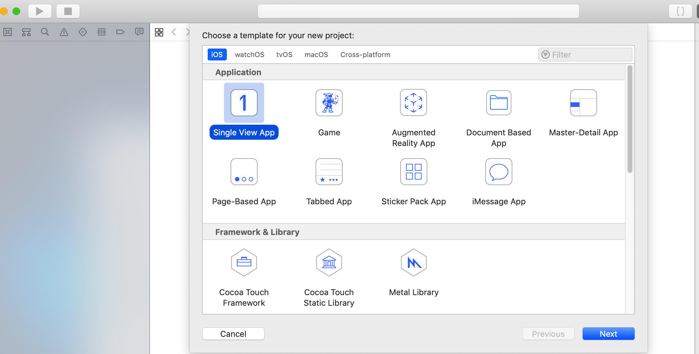   
2. 输入Project Name ,**"Organization Identifier"**使用个人网页或企业网页相反着写,例如 `com.example` 使用真机调试,Team 和Organization Identifier根据证书相应填写,语言选Swift
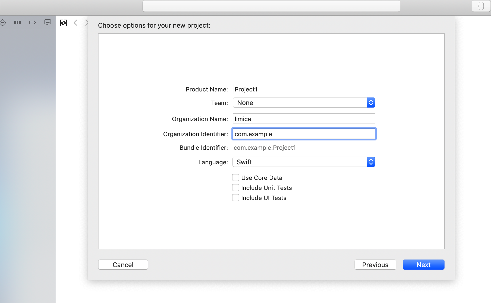    
3. 点击`Next` 我们创建了一个空的工程项目,运行项目选择使用设备或模拟器 `Product>Destination` 或者在Xcode左上角,项目名称后选择相应设备或模拟器,真机需连接电脑调试. 
4. 运行程序选择程序左上角三角按钮 或者使用快捷键 `Cmd+R`
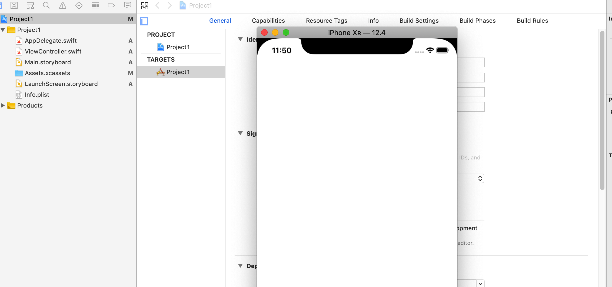
5. 停止运行程序使用左上角四角按钮 或者使用快捷键 `Cmd+.`
6. 向项目中拖进一个图片文件夹放info.plist下
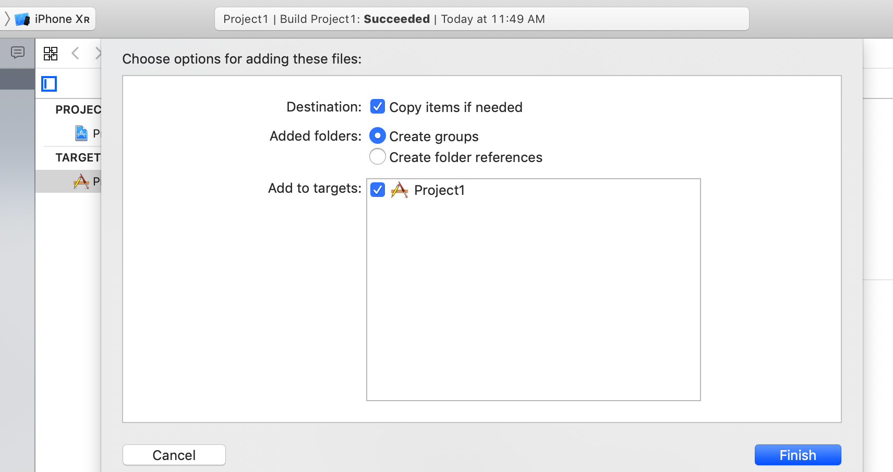

### Listing images with FileManager
打开项目`ViewController.swift` 这个就是那个空白页

```
import UIKit

class ViewController: UIViewController {

    override func viewDidLoad() {
        super.viewDidLoad()
        // Do any additional setup after loading the view.
    }
 
```           
1. `import UIKit` 是引入iOS界面工具包
2. `class ViewController: UIViewController` 创建一个视图`ViewController`类继承 苹果视图基类`UIViewController `
3. `override func viewDidLoad()` 重写苹果基类`UIViewController `中视图完成加载方法 `viewDidLoad()` 这里你可以自定义视图
4. `super.viewDidLoad()` 在执行重写的`viewDidLoad()`之前,先执行父类的`viewDidLoad()`    

在`super.viewDidLoad()`之后加入操作文件包的操作     
		
```
let fm = FileManager.default
let path = Bundle.main.resourcePath!
let items = try! fm.contentsOfDirectory(atPath: path)
        
for item in items {
    if item.hasPrefix("nssl"){
         //这里加载一个图片

    }
}
        
```


`let fm = FileManager.default`	创建系统文件操作类
`let path = Bundle.main.resourcePath!` path指向应用程序包的资源路径
`let items = try! fm.contentsOfDirectory(atPath: path)`  指向路径中目录的内容

	
我们在`viewDidLoad()`之前创建一个类的属性pictures接收包路径下的图片地址 				

```
var pictures = [String]()
```		
在循环中想pictures中添加包中的每个图片

```
pictures.append(item)
```
在`viewDidLoad()` 打印pictures 会在控制台中看到一个路径字符串数组
### Designing our interface
为了用户操作查看图片,我们创建一个列出图像列表的用户界面
我们的`ViewController`继承自最基本控制器`UIViewController`,iOS还有另一种列表控制器`UITableViewController` 使用很广泛,我们可以把`ViewController `修改为继承`UITableViewController `方便我们展示图片列表    
**首先:**

```
class ViewController: UIViewController {
```

修改为:

```
class ViewController: UITableViewController {
```

修改完代码里继承关系以后,我们需要修改**Interface Builder(IB)** 保证与代码匹配
**接下来:**
点击`Main.storyboard` 你会看到`IB`视图
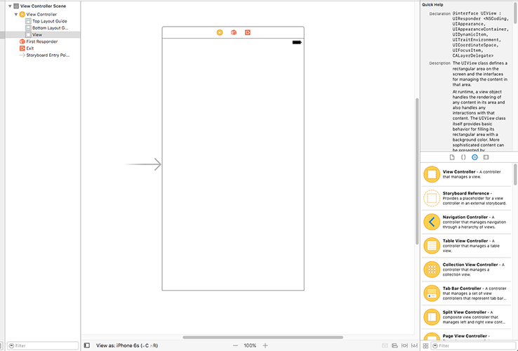
你可以往空视图上拖进去任意控件,然而我们用不到,我们需要的是`UITableViewController` 所以选中并删除,接下来创建我们的`UITableViewController`视图

使用快捷键`Cmd+Shift+L` 或者 View->Libraries -> Show Library
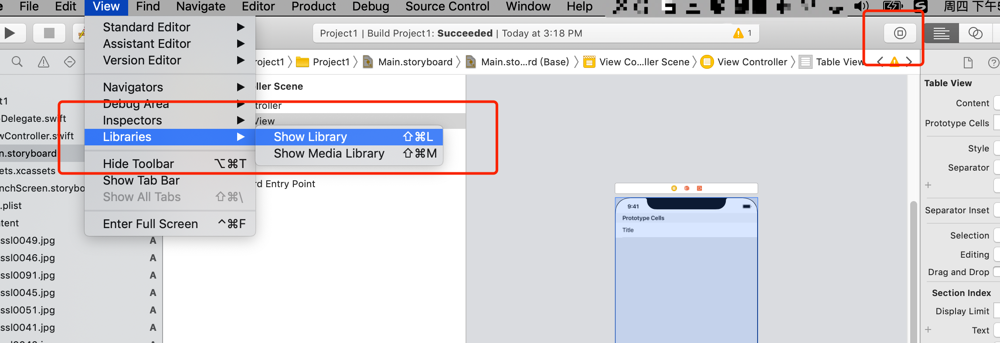
这里有很多控件,选择`UITableViewController `拖到storyboard上
> **小技巧:** 如果要保持拖动控件后,控件选择视图不消失,使用`Alt+Cmd+Shift+L` 快捷键,使选择控件视图变为一个窗口

1.使用快捷键`Alt+Cmd+3`或者 View -> Inspectors -> Show Identity Inspector 把类名改为`ViewController`

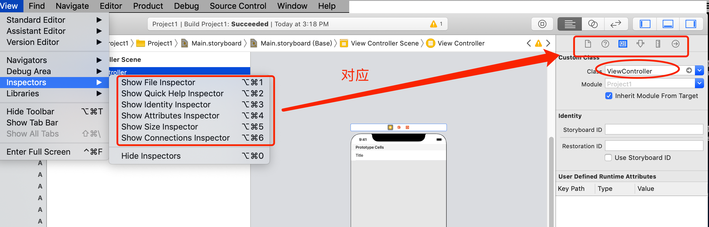

2.通知Xcode首次启动使用这个页面,使用快捷键`Alt+Cmd+4`或者View -> Inspectors -> Show Attributes Inspector,选中 **`Is Initial View Controller`**

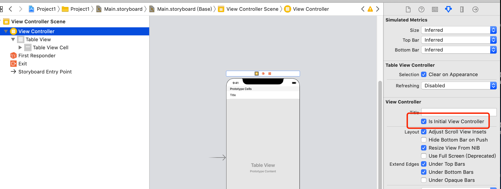

3.选中ViewController -> TableView ->TableViewCell,
在 attributes inspector中, Identifier 这一项输入**Picture**,在Style这一项中把Custom改为Basic

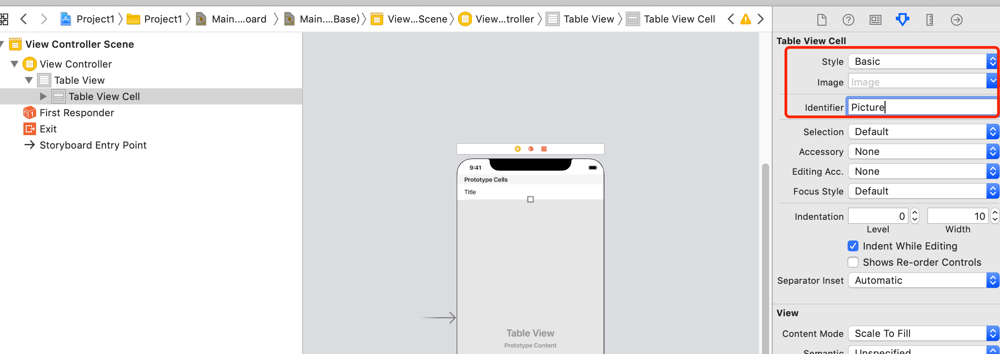

4.为`ViewController`加导航栏

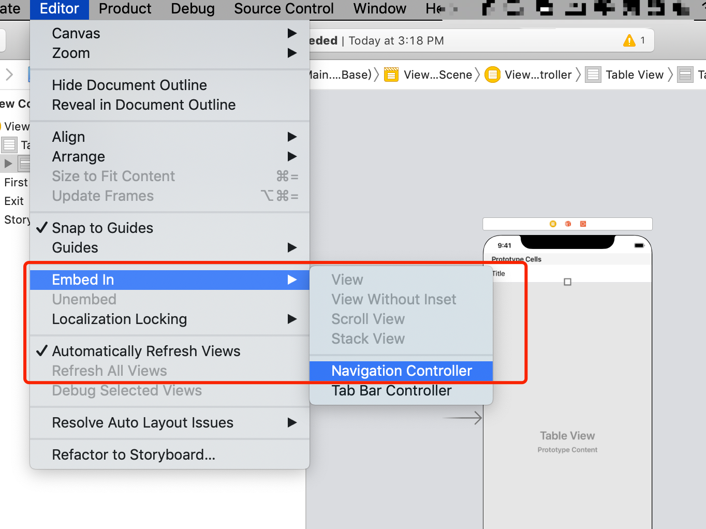
加完以后,导航控制器自动成为初始控制器

---
为`UITableViewController`增加数据

需要重写UITableViewController 的方法

```
//tableView 有多少条数据
override func tableView(_ tableView: UITableView, numberOfRowsInSection section: Int) -> Int {
    return pictures.count
}

```

通过Pictures中的数据给tableView中每一行的Label控件赋值

```
//给tableView中cell赋值
override func tableView(_ tableView: UITableView, cellForRowAt indexPath: IndexPath) -> UITableViewCell {
    let cell = tableView.dequeueReusableCell(withIdentifier: "Picture", for: indexPath)
    cell.textLabel?.text = pictures[indexPath.row]
    return cell
}
```

-
运行我们的项目可以看到界面显示效果:
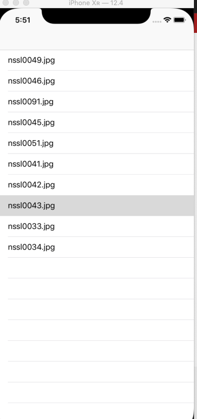