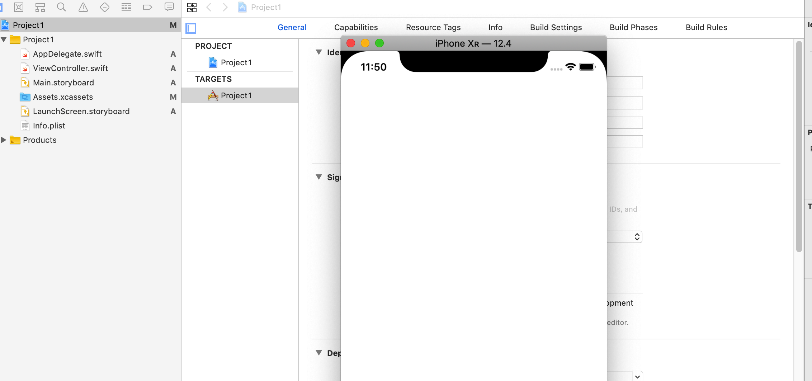

# Swift Day 16
> 项目实践:今天有三个主题,主要使用到viewController storyboards 和 FileManager

### Setting up

1. 启动Xcode -> `Create a new Xcode project` -> `Single View App`
   
2. 输入Project Name ,**"Organization Identifier"**使用个人网页或企业网页相反着写,例如 `com.example` 使用真机调试,Team 和Organization Identifier根据证书相应填写
    
3. 点击`Next` 我们创建了一个空的工程项目,运行项目选择使用设备或模拟器 `Product>Destination` 或者在Xcode左上角,项目名称后选择相应设备或模拟器,真机需连接电脑调试. 
4. 运行程序选择程序左上角三角按钮 或者使用快捷键 `Cmd+R`

5. 停止运行程序使用左上角四角按钮 或者使用快捷键 `Cmd+.`

### Listing images with FileManager

### Designing our interface