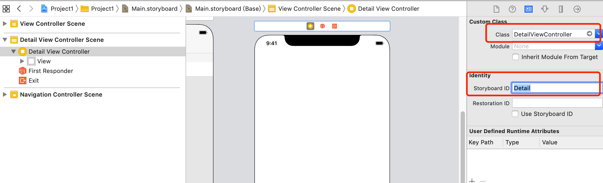

# Swift Day 17
> 项目实践:今天有三个主题,主要使用到UIImageView UIImage 和 UINavigationBar 等

### Building a detail screen
我们的app界面有多行显示图片名称,但是点击没有任何效果,接下来我们要做的是点击进入另一个详情页面展示图片

* 创建DetailViewController
New -> File -> iOS -> Cocoa Touch Class -> Next


* storyboard中创建DetailViewController
从控件列表视图中选择ViewController拖到Main.storyboard中,并指定类名和Storyboard ID


为了`DetailViewController`中显示照片,我们是用UIKit中的图像视图`UIImageView`,同样的从控件列表视图中找到`UIImageView`拖进`DetailViewController `的view中,并调整`UIImageView`视图大小

我们可以是用Auto Layout调整UIImageView在父视图的显示,以适应iphone和iPad中不同的显示效果
Auto Layout的内容很多,但有两个规则:

* 你的约束必须是完整的
* 你的约束不能有冲突
下面给`UIImageView`加约束,**Editor-> Resolve Auto Layout Issues > Reset To Suggested Constraints** 或者使用快捷键 `Shift+Alt+Cmd+=`

接下来让Interface Builder 的imageView与DetailViewController 代码关联,
保证imageView选中,**View > Assistant Editor > Show Assistant Editor**或者快捷键`View > Assistant Editor > Show Assistant Editor`,这时候屏幕分隔成两个,一个是Interface Builder另一个是DetailViewController文件代码,

也可以View -> Assistant Editor -> Assistant Editors On Right 或者 Assistant Editors on Bottom,使两个界面上下分布和左右分布
如何将imageView 与DetailViewController 关联起来:
1.保证imageView选中
2.按下Ctrl键
3.点击鼠标左键,不松手拖到右边代码处
4.出现蓝色的线以后,松开鼠标,弹出设置属性相关界面


点击connect
然后代码中出现如下代码

```
class DetailViewController: UIViewController {

    @IBOutlet weak var imageView: UIImageView!
    override func viewDidLoad() {
        super.viewDidLoad()

        // Do any additional setup after loading the view.
    }
```
`@IBOutlet`标示和IB关联

### Loading images with UIImage
我们需要在`ViewController` 的图片列表中执行一个点击方法,然后跳转到详情页面`DetailViewController`中显示相应的图片
tableView 有一个方法`tableView(_, didSelectRowAt:)`点击相应的行处理相关事件

1.在`DetailViewController`中创建一个属性接收图片名字加载图片

```
var imageName: String?
```

2.`ViewController`执行`didSelectRowAt`从storyboard加载DetailViewController

```
override func tableView(_ tableView: UITableView, didSelectRowAt indexPath: IndexPath) {
    //加载detail viewController DetailViewController类的实例
    if let vc = storyboard?.instantiateViewController(withIdentifier: "Detail") as? DetailViewController{
        //点击的哪一个图片的名字
        vc.imageName = pictures[indexPath.row]
        //push到DetailViewController 在detailViewController 中显示图片
        navigationController?.pushViewController(vc, animated: true)
    }
    
}
```
3.在DetailViewController中将接收到的imageName,imageView根据图片名称展示图片

```
override func viewDidLoad() {
    super.viewDidLoad()
    if let imageToLoad = imageName {
        self.imageView.image = UIImage(named: imageToLoad)
    }
    // Do any additional setup after loading the view.
}
```


### Final tweaks: hidesBarsOnTap, safe area margins
图片的显示拉伸模式也可以修改,有很多种,可以自己试一下看效果


为了让图片在屏幕中全部显示,并且没有navigation bar,这需要用到`UINavigationController`的一个属性`hidesBarsOnTap`,true的时候,用户点击任意地方隐藏导航栏,再次点击显示导航栏    
**注意:**设置这个属性需小心设置,如果一直设置,可能影响其他的点击事件,所以在DetailViewController视图显示的时候使用,消失的时候销毁

这时候需要了解DetailViewController的生命周期,涉及到几个方法:

`viewWillAppear()`, `viewDidAppear()`, `viewWillDisappear()` 和`viewDidDisappear()`
根据方法名称很好理解具体代表的意思

我们主要在`viewWillAppear()`, `viewWillDisappear()` 两个方法中设置这个显示隐藏的属性

```
override func viewWillAppear(_ animated: Bool) {
        super.viewWillAppear(animated)
        navigationController?.hidesBarsOnTap = true
    }
    override func viewWillDisappear(_ animated: Bool) {
        super.viewWillDisappear(animated)
        navigationController?.hidesBarsOnTap = false
    }
```

可以为tableViewCell设置 引导跳转箭头,设置如下:


`ViewController`和`DetailViewController`都有导航栏,可以设置导航栏标题,使用自带的`title` 属性

#### 大标题
Apple的设计指南之一是使用大型标题 - 应用程序顶部灰色栏中显示的文本。默认样式是小文本.如何使用大标题呢.几行代码就可以实现

在ViewController.swift的 `viewDidLoad()`中加入以下代码

```
navigationController?.navigationBar.prefersLargeTitles = true
```

运行程序会发现列表页和详情页的导航栏都变成大标题,tableview向上滑动,标题会变小

如果不想在所有页面使用大标题,在相应的`DetailViewController`中加入以下代码,禁止大标题

```
navigationItem.largeTitleDisplayMode = .never
```