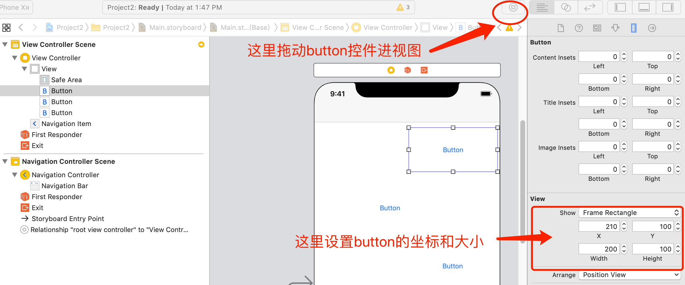
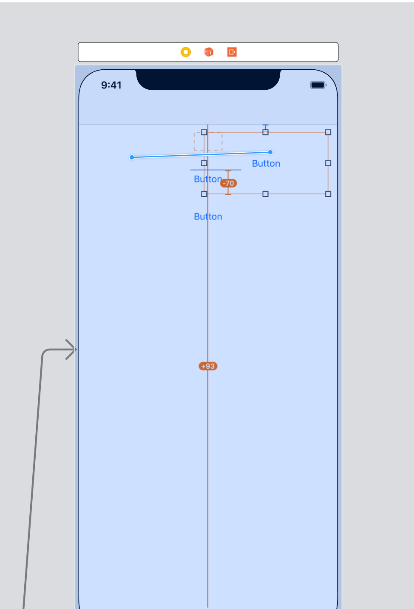
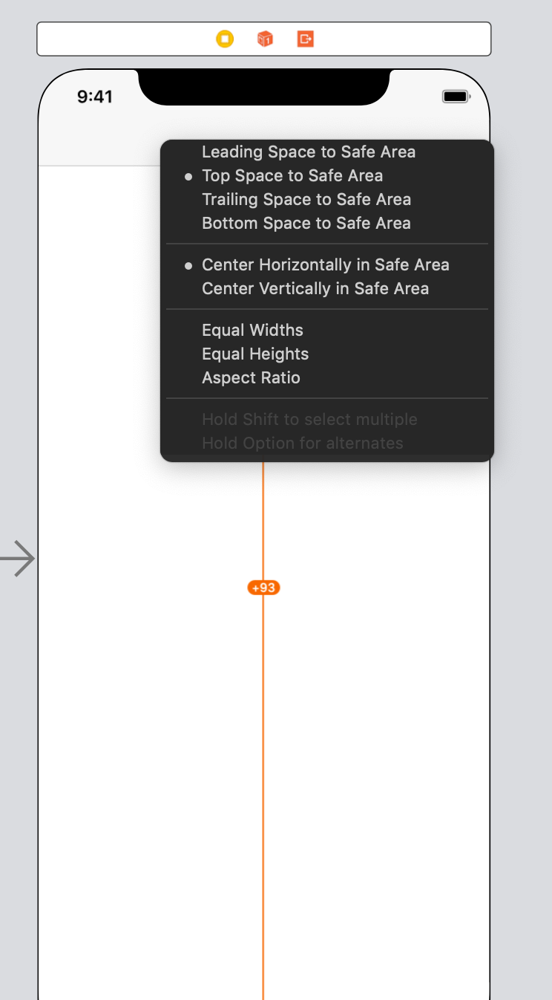
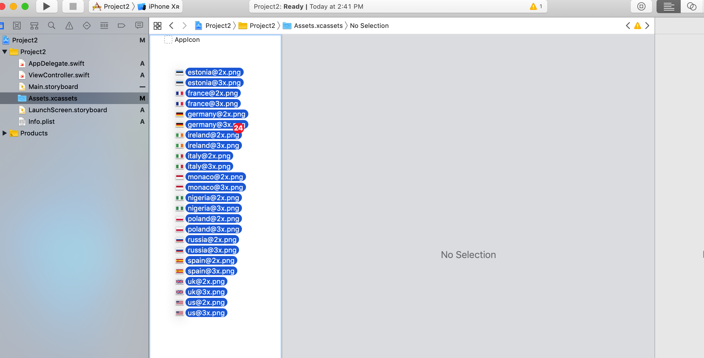
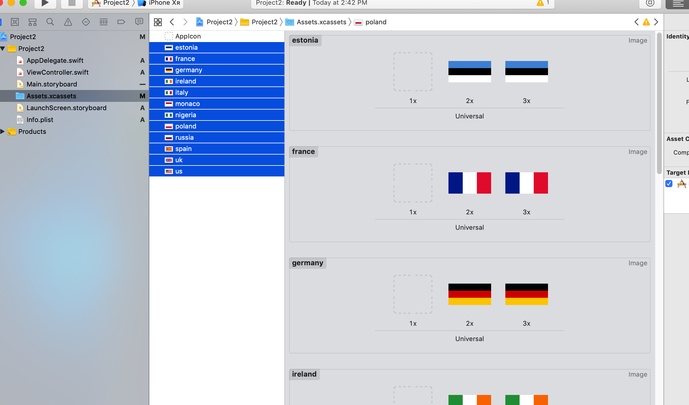
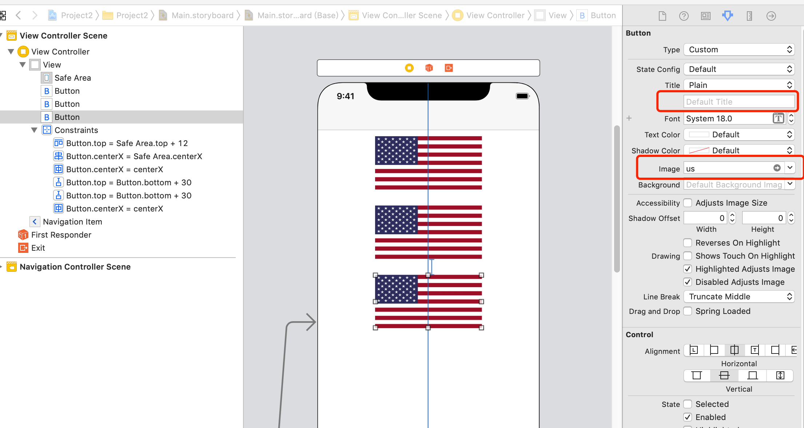

# Swift Day 19

>今天主要学习 Asset 目录,按钮,颜色等等

## setting up
>这个项目,我们创建一些随机旗帜,让用户选择哪个属于特定的国家

打开Xcode -> Create a new project ->Single View App 命名project2 ,并记得选swift语言
## Designing your layout
在这个游戏里,用户根据导航栏里的国家名称选择给定的三个旗帜,导航栏我们上一个项目学习过了,如果不记得,在复习一下,选中Main.storyboard中的ViewController,xuanze Editor->Embed In ->Navigation Controller,导航栏就创建好了
向视图里拖进三个长200pt,宽100pt的Button,并设置三个button的y坐标分别为100,230,360


下面使用AutoLayout 约束button,选中第一个button,Ctrl+鼠标左键 拖到父视图上 


选择水平居中和距上边距的距离,另外两个button都水平居中,距上个button距离30


接下来把资料旗帜的图片拖进来,上个项目创建了一个文件夹拖进工程使用,这一次我们使用苹果给提供好的资源图片管理工具存储图片使用,更方便快捷
选中Assets.xcassets ,将准备好的资源图片拖进来

苹果自动识别图片名称的@2x和@3x自动分类

2倍图和3倍图代表你IB中创建视图的2倍和3倍显示大小,因为刚开始没有视网膜屏,后来视网膜屏的出现,像素数量变成以前的两倍,后来的三倍,苹果会自动将像素大小转换为点,在非视网膜设备上使用一倍图,视网膜设备上选择使用2倍还是3倍图.
给button设置旗帜图片,删除title并设置image为us,button的大小会自动根据图片大小改变

把button和ViewController关联起来,根据第一个项目中学的`Alt+Cmd+Return` 或者 `View -> Assistant Editor -> Show Assistant Editor` 在ViewController中创建`button1`,`button2`,`button3`属性
## Making the basic game work:UIButton and CALayer
首先我们需要一个存放旗帜图片名称的数组,还有一个用户的得分情况,所以创建两个属性

```
var countries = [String]()
var score = 0
```

然后在`viewDidLoad()`中为countries添加元素

```
countries.append("estonia")
countries.append("france")
countries.append("germany")
countries.append("ireland")
countries.append("italy")
countries.append("monaco")
countries.append("nigeria")
countries.append("poland")
countries.append("russia")
countries.append("spain")
countries.append("uk")
countries.append("us")
```

当然也可以使用一种更有效的方法添加:

```
countries += ["estonia", "france", "germany", "ireland", "italy", "monaco", "nigeria", "poland", "russia", "spain", "uk", "us"]
```

下一步是写一个方法随机展示三个旗帜图片在界面上,Button 有 `setImage()` 方法可以选择什么时候在里面显示图片
在`viewDidLoad()`下增加方法

```
func askQUestion(){
    button1.setImage(UIImage(named: countries[0]), for: .normal)
    button2.setImage(UIImage(named: countries[1]), for: .normal)
    button3.setImage(UIImage(named: countries[2]), for: .normal)
}
```
然后在`viewDidLoad()`最后增加方法调用`askQUestion()`

然后运行你会发现有两个小问题:
1.我们正在展示Estonian和Estonian的旗帜，两者都有白色，很难区分是旗帜图片还是颜色块
2.总是显示这三张图片
首先第一个问题.iOS中关于视图的许多强大功能之一是它们被所谓的CALayer支持，CALayer是一个核心动画数据类型，负责管理视图的外观,所以我们可以给每个button一个边框和边框颜色,代表边框里面的就是旗帜图片

```
button1.layer.borderWidth = 1
button2.layer.borderWidth = 1
button3.layer.borderWidth = 1
button1.layer.borderColor = UIColor.lightGray.cgColor
button2.layer.borderColor = UIColor.lightGray.cgColor
button3.layer.borderColor = UIColor.lightGray.cgColor
```
UIColor有一个名为lightGray的属性，它返回一个表示浅灰色的UIColor实例。但我们不能将UIColor放入borderColor属性，因为它属于CALayer，它不了解UIColor是什么。因此，我们将.cgColor添加到UIColor的末尾，以使其自动转换为CGColor

你也可以自定义边框的颜色

```
//红绿蓝的值从0-1
UIColor(red: 1.0, green: 0.6, blue: 0.2, alpha: 1.0).cgColor
```