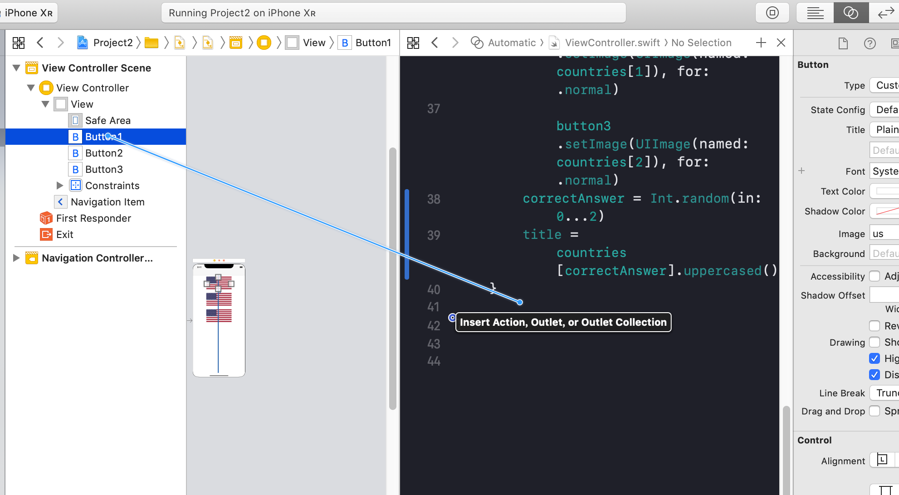
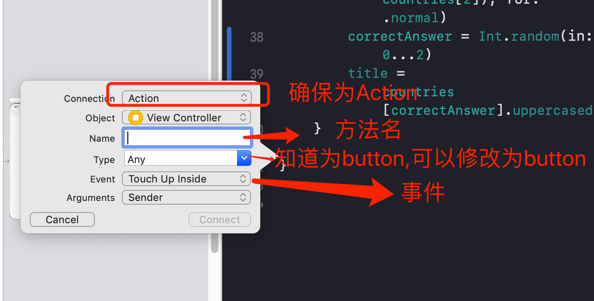
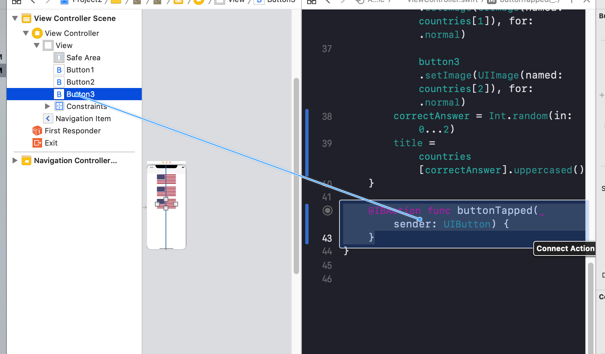
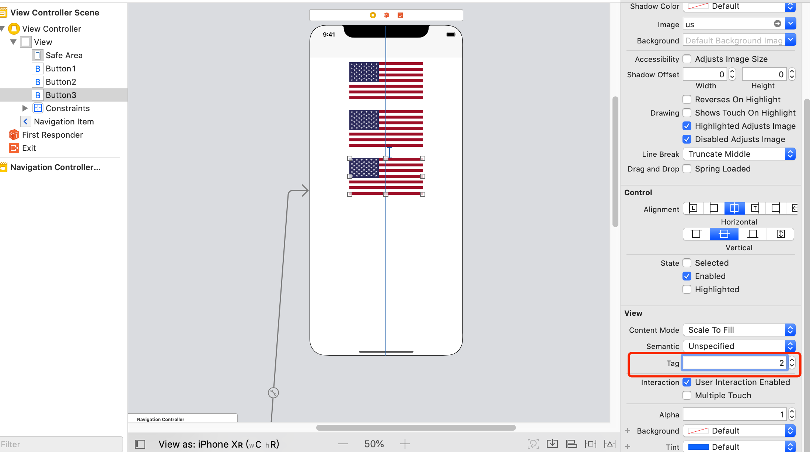
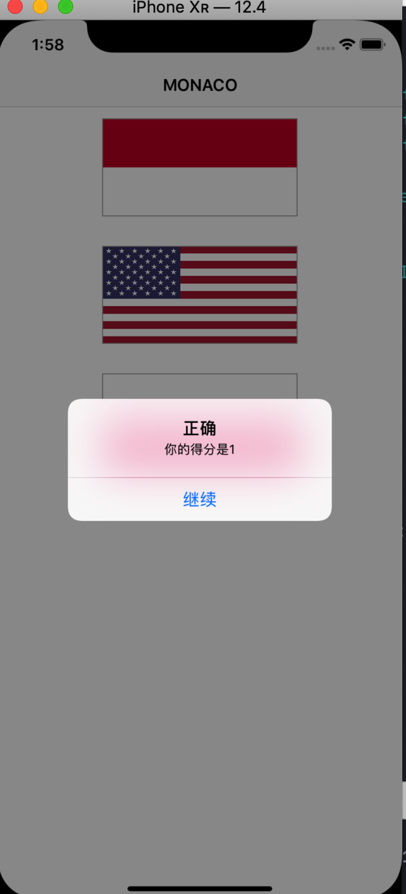

# Swift Day 20

>今天又两个主题,你会用到随机数 `@IBAction` 和 `UIAlertController`

## Guess which flag: random numbers

要想使旗帜随机出现,我们有两种方法    
1.选择三个随机数,用随机数从数组内读取国旗    
2.打乱数组顺序,选择前三个元素    
同时,我们应该保证三个旗帜是不同的    
第二种方法更容易实现，因为Swift具有用于改组数组的内置方法：用于就地改组的`shuffle()`和用于返回新的洗牌数组的`shuffled()`。

所以在`askQuestion()`执行最前面,,就是最开始`setImage()`的时候,加入  
  
```
countries.shuffle()

```

这样你的数组前三个都是不一样的旗帜,多运行一次程序看看,你会发现,每次的旗帜是不一样的

下一步是选择正确的答案,所以我们需要有一个属性`correctAnswer`正确答案

```
//正确答案为 0 ,1 ,2 中的一个即三个中的一个是正确的
var correctAnswer = 0
```

要选择哪个应该是正确的答案需要再次使用Swift的随机系统，因为我们需要为正确的答案选择一个随机数。所有Swift的数字类型，如`Int`，`Double`和`CGFloat`，都有一个随机`（in :)`方法，可以在一个范围内生成一个随机数。因此，要生成0到2之间的随机数，您需要将此行放在`askQuestion()`中的三个`setImage()`调用之下：

```
correctAnswer = Int.random(in: 0...2)
```
现在我们知道 正确答案是哪个,我们需要获取到`countries`中的名称放到导航栏上供用户去选择正确的答案, `coutries` 中的名称都是先写,放到导航栏上不好看,我们可以使用`String` 的`uppercased()`使字母大写显示,在设置`correctAnswer`之后加上

```
title = countries[correctAnswer].uppercased()
```
但是现在用户点击旗帜按钮,没有任何效果,没有提示正确和错误,也没有分数显示,接下来我们开修复它
## From outlets to actions: creating an IBAction

让IB中按钮的点击事件与代码关联		
选择第一个按钮,通过Ctrl鼠标左键,拖动一个方法到`askQuestion()`之后,正确的话你回看到`Insert Outlet, Action, or Outlet Collection`,**注意:不要把Action改成outlet**




完成后你会在`ViewController`中看到按钮的点击方法

```
@IBAction func buttonTapped(_ sender: UIButton) {
}
```
然后将其他两个按钮的点击事件也与这个方法相关联,相当于,每个按钮点击的时候,都会在`buttonTapped`中执行.

>@IBOutlet 是一种将代码与storyboard关联,  @IBAction 是 storyboard触发代码方法

三个按钮都触发这个方法,所以我们需要对按钮点击事件进行区分,怎么区分呢?每个button都可以有一个标识`Tag`,我们可以对三个button设置不同的Tag,根据Tag值不同进行判断不同的按钮点击,按顺序设置Tag0,1,2


按钮的点击事件`buttonTapped()`里主要处理三件事:1.检查答案是否正确,2.调整用户的得分,3给出一个最新得分的提示

1和2很好处理,根据Tag不同,判断正确答案,并计算得分增加还是减少

```
var title: String!
if sender.tag == correctAnswer {
    title = "正确"
    score += 1
} else {
  title = "错误"
    score -= 1
}
```

对于第3点,我们可以使用一个类`UIAlertController()`来弹出提示框,显示得分信息

```
let ac = UIAlertController(title: title, message: "Your score is \(score).", preferredStyle: .alert)
ac.addAction(UIAlertAction(title: "Continue", style: .default, handler: askQuestion))
present(ac, animated: true)

```
但是这么写会产生一个错误,,我们需要修正一下,
第二行增加一个按钮"继续",style有三个选择`.default` , `.cancel`和`.destructive`,最后一个参数 `handler:askQuestion` handler是一个闭包`(UIAlertAction)->void?`,而我们的`askQuestion`并没有参数,所以,我们可以给`askQuestion`加一个UIAlertAction参数

```
func askQuestion() {
```

修改为:

```
func askQuestion(action: UIAlertAction!) {
```

在`viewDidLoad()`中调用`askQuestion()`给一个默认的参数`nil`

```
askQuestion(action: nil)
```
当然你也可以在修改`askQuestion`方法,给你一个默认参数nil

```
func askQuestion(action: UIAlertAction! = nil) {
```
这样在`viewDidLoad()`中调用`askQuestion()`不用做更改

然后运行我们的程序:

