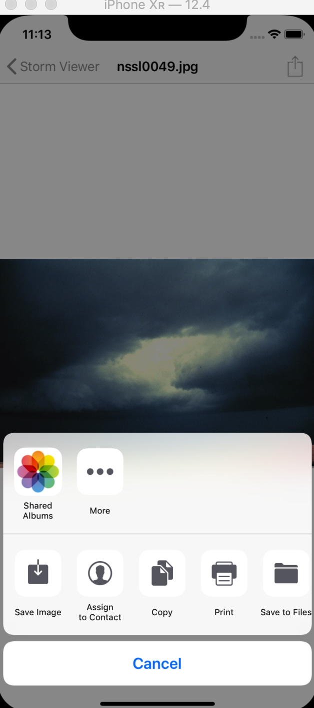
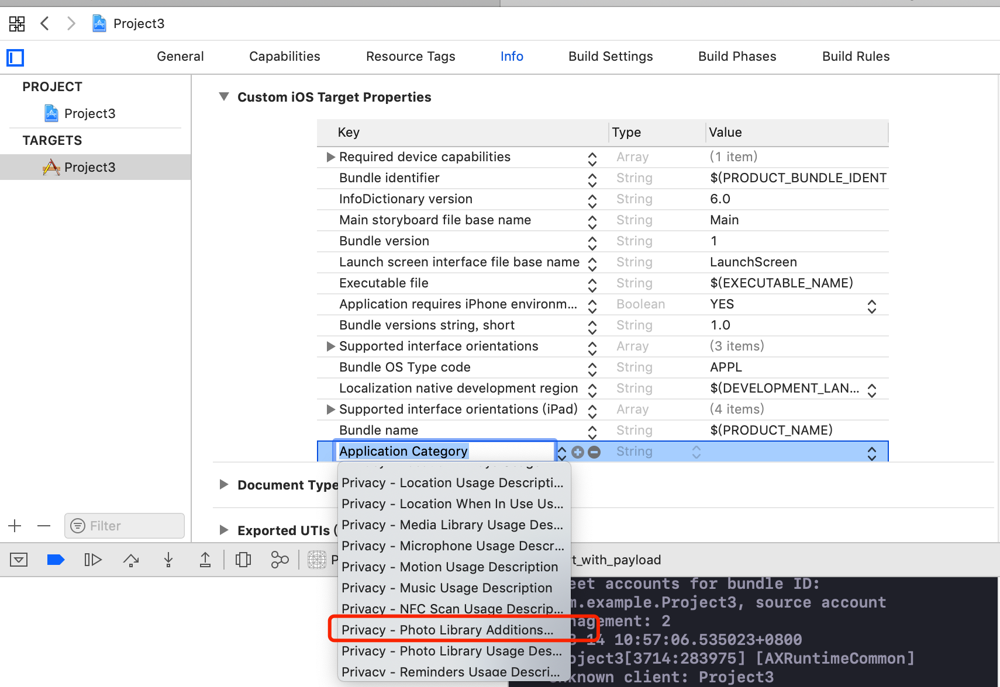

# Swift Day 22
>今天又三个主题,会用到`UIBarButtonItem`,`UIActivityViewController`,完成本内容并完成三个挑战

## About technique projects
我们知道,app的种类有很多种.有商城,有游戏,有技术类,项目1是让用户在手机上浏览图像,项目2 是用户猜测国家旗帜的游戏

技术项目的目的是选择一个iOS技术并深入了解它,有的可能简单,有的可能比较复杂,所以我会尽可能缩短时间,让你更专注于做实际的东西

第一个技术项目很简单:就是修改项目1,允许用户与朋友分享图像

## UIActivityViewController explained
分享内容使用iOS提供的允许其他apps接收的强大标准组件,这个组件称为`UIActivityViewController`,你告诉它要分享的数据类型,它选择出最好的方式去分享

当我们处理图像的时候,`UIActivityViewController`可以自动的给我们提供功能选择,通过`iMessage`,`email`,`Twitter`和`Facebook`分享,同时,我们可以保存图片到相册,指定给联系人,打印,拷贝等等,

在我们接触`UIActivityViewController`之前,我们需要给处于一个触发分享的方法,我们可以在导航栏上增加一个 barButtonItem

我们拷贝项目1的所有文件,并更改为项目3,用Xcode启动,并打开DetailViewController.swift文件,在`viewDidLoad()`方法里加入

```
navigationItem.rightBarButtonItem = UIBarButtonItem(barButtonSystemItem: .action, target: self, action: #selector(shareTapped))
```
这里会有一个报错,因为未实现`shareTapped`方法,先往下看
这段代码分成两部分,左边是分配一个`rightBarButtonItem`给ViewControlller的`navigationItem`,这是导航栏右侧的一个按钮展示相关信息,并触发相应的事件 		
右边是创建了一个`UIBarButtonItem`,有三个参数: barButtonSystemItem,target, action; barButtonSystemItem是个枚举,有很多选项,这里我们用.action分享的图标代表用户点击时可以做一些事情, target ...action两个参数一般是一起的,代表那个类执行某个方法,这是的self代表当前ViewController;  `#selector`指定一个方法在点击的时候触发		
如果你不喜欢系统提供的按钮样式,可以使用图标自定义

BarButton创建好了,但是`shareTapped()`方法未创建,接下来我们创建这个方法,触发分享的操作

```
@objc func shareTapped() {
    guard let image = imageView.image?.jpegData(compressionQuality: 0.8) else {
        print("没有图片")
        return
    }
    let vc = UIActivityViewController(activityItems: [image], applicationActivities: [])
    vc.popoverPresentationController?.barButtonItem = navigationItem.rightBarButtonItem
    present(vc, animated: true, completion: nil)
    
}
```
> * 方法前面用`@objc`修饰,是因为我们使用了Objective-C的系统内的(`UIBarButtonItem`),所以用`@objc`修饰表示可以接受Objective-C代码,使用`#selector`的都需要加上`@objc`
> * imageView可能没有图片,所以我们为了安全起见,转换成JPEG数据,`compressionQuality`参数带白哦压缩值从0.0~1.0
> * 下一步我们创建一个分享内容给其他app或者系统的`UIActivityViewController`
> * 最后将ActivityViewController与rightBarButtonItem事件关联

在iphone上, ActivityViewController占满整个屏幕,在iPad上是一个popover视图,锚点指向rightBarButtonItem



### 修复一个小bug
当前代码有一个小的但很重要的bug,当你选择保存图片到相册的时候,你会看到app直接闪退了,这是因为当app写入相册的时候,必须由用户同意允许访问相册

修复这个问题,我么需要修改info.plist文件,选择info.plist文件,选择'Add Row'(+号),会有一个以`Application Category`列表,滑动列表找到`Privacy - Photo Library Additions Usage Description`,这个是在添加图片到相册的时候展示给用户的提示

选择了`Privacy - Photo Library Additions Usage Description`以后,右边是一个`String`,空白处可以填写当保存到相册时展示给用户的提示信息,比如"我们需要存储你喜欢的图像"

现在重新运行app,当选择保存到相册的时候会给出一个提示选择,是否允许写入图像到相册
## Wrap up

这是个在已有的app新增的简单的功能,这里你学习了`UIBarButtonItem`和`UIActivityViewController`

[复习项目3](https://www.hackingwithswift.com/review/hws/project-3-social-media)

### 挑战
学习的最好方式之一就是极可能经常自己写代码,这里有三个任务提升你的能力

1. 分享的时候增加图片名称,`activityItems`参数是一个数组,你可以自由的增加字符串,注意:Facebook不允许分享文字

2. 在项目1中的主ViewController中增加BarButtonItem,分享app给其他人
3. 在项目2中增加BarButtonItem,分享游戏得分