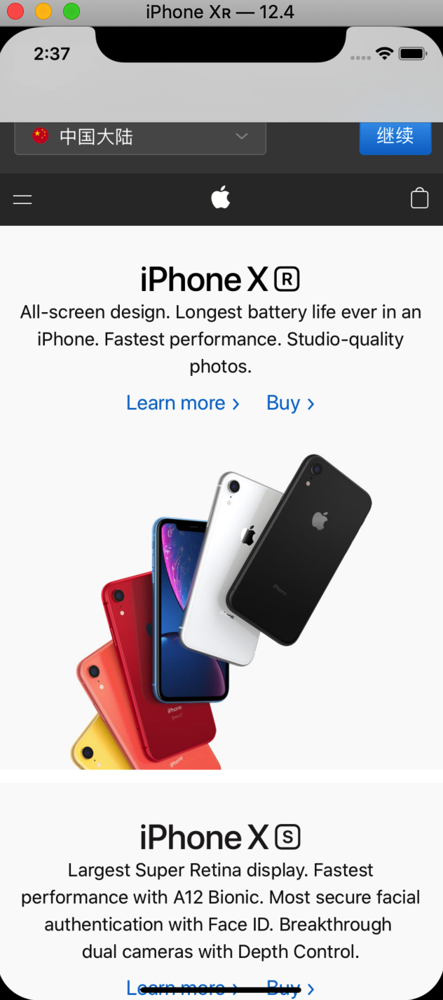
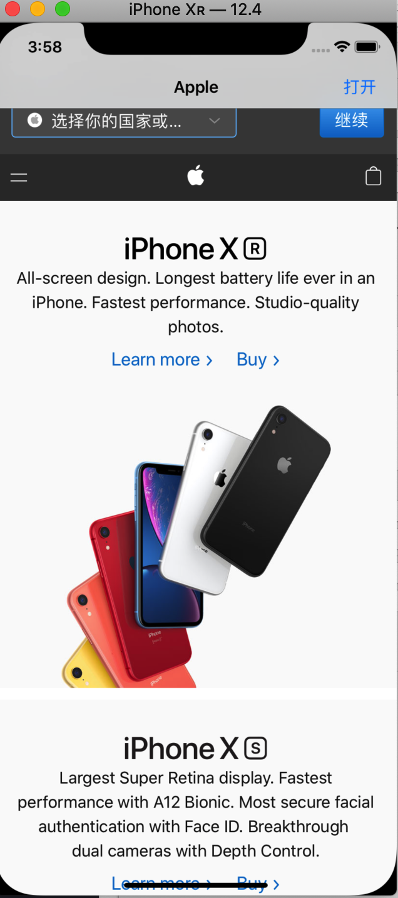

# Swift Day 24

>这个项目我们使用WebKit创建一个小的网页浏览器,只需要大概60行代码就可以轻松实现,今天又三个主题,你将使用到`WKWebView`,`ActionSheet`等等

## Setting up
在这个项目中,你会学习到`UIBarButtonItem` 和`UIAlertViewController`的新知识,这是个简单的项目,不仅可以学习新的内容还能复习之前学过的

这个项目我们会接触到`WKWebView`,`UIToolBar`,`UIProgressView`,代理,属性观察器等等

开始,我们需要启动Xcode,像之前一样简历一个Single View App,项目名为Project4,使用语言为Swift,并为ViewController增加导航控制器
## Creating a simple browser with WKWebView
在前几个项目中我们已经对IB比较熟悉了,我们可以在上面创建按钮视图等,这个项目我们将使用webView作为Controller的主要视图

到目前为止，我们一直使用viewDidLoad()方法在加载视图的布局之后配置视图。这一次，我们需要重写视图的实际加载，因为我们不想让storyboard上是空的，我们需要用自己的代码。它仍然会被放在导航控制器中，但是配置由我们决定

iOS有两种方式使用webView,我们这个项目里使用`WKWebView`,它是WebKit资源包的一部分而不是UIKit,所以我们可以引入这个包在`ViewController.swift`文件顶部

```
import WebKit
```

当我们创建webView的时候,我们需要创建它作为一个类属性以便后面使用

```
var webView: WKWebView!
```

最后,我们需要增加一个新的方法在`viewDidLoad()`之前

```
override func loadView() {
    webView = WKWebView()
    webView.navigationDelegate = self 
    view = webView
}
```
这个代码现在报错,我们接下来修复它

> **注意:** 并不是必须要把`loadView()`放在`viewDidLoad()`之前,你可以放在`ViewController`类中的任何地方,然而,我鼓励你创建方法结构有条理性,因为`loadView()`在`viewDidLoad()`之前执行,所以,把它放前面是合理的

不管怎样,方法有三个行需要关注,第一是,我们创建了一个`WKWebView`示例赋值给`webView`属性,第三是我们view(`ViewControlller`的根视图)变为webView		
是的,我没有说第二行,因为第二行引出了一个新的概念:**代理**,代理是一种设计模式,在iOS中广泛使用,因为好理解,易使用,很灵活

代理就是自己代替别人回答问题和响应事件,在我们的例子中,当有事件发生的时候,`WKWebView`通知到我们,所以我们设置webView的`navigationDelegate`属性给`self`,这表示当网页导航发生时告诉我---即当前控制器		
1. 你必须遵守协议。这是一种奇特的说法，“如果你告诉我你可以成为我的代理，这里有你需要实现的方法。”对于`navigationDelegate`，所有这些方法都是可选的，这意味着我们不需要实现任何方法。		
 2. 您实现的任何方法现在都可以控制`WKWebView`的行为表现。任何未实现的都将使用WKWebView的默认行为。
 
设置任何委托时，需要符合与委托匹配的协议。所有的navigationDelegate协议方法都是可选的，但Swift还不知道。它所知道的是，我们设置了WebView的代理，但尚未实现该协议。所以解决报错,我们需要让`ViewController`遵守`WKNavigationDelegate`协议

```
class ViewController: UIViewController {
```
修改为:

```
class ViewController: UIViewController, WKNavigationDelegate {
```

接下来webView访问一个网页,在`viewDidLoad()`里加入

```
let url:URL! = URL(string: "https://www.apple.com")
webView.load(URLRequest(url: url))
//允许用户从左侧或右侧边缘滑动以在其Web浏览中向后或向前移动。这是许多用户所依赖的Safari浏览器的一项功能
webView.allowsBackForwardNavigationGestures = true
```

**注意:你访问的网页应该是https://,因为苹果不喜欢app发送接收不安全的数据**

这里我们把一个网页字符串转化成`URL`.把`URL`放到`URLRequest`中,然后`WKWebView`加载出来网页
运行app

## Choosing a website:UIAlertController action sheets

接下来,我们给用户增加一个选项,让用户选择给定的几个网址打开,这需要我们先创建个按钮,触发事件,弹出网址选项,然后执行加载网页

所以我们先在导航栏上加一个BarButtonItem,在`viewDidLoad()`里创建`UIBarButtonItem`(一般都在`super.viewDidLoad()`之后)

```
navigationItem.rightBarButtonItem = UIBarButtonItem(title: "打开", style: .plain, target: self, action: #selector(openTapped))
```
然后在实现`openTapped `方法,在方法里创建弹框选择网页视图

```
@objc func openTapped() {
    let alert = UIAlertController(title: "打开网页", message: nil, preferredStyle: .actionSheet)
    alert.addAction(UIAlertAction(title: "apple.com", style: .default, handler: openPage))
    alert.addAction(UIAlertAction(title: "google.com", style: .default, handler: openPage))
    alert.addAction(UIAlertAction(title: "取消", style: .cancel))
    alert.popoverPresentationController?.barButtonItem = self.navigationItem.rightBarButtonItem
    present(alert, animated: true)
    
}
```
>与之前我们使用`UIAlertController`有几点不同的是:1.我们不需要message,所以传nil;2.我们的`preferredStyle`是`.actionSheet`是因为我们需要有更多选项;3.我们增加一个`.cancel`按钮,不用提供`handler`,因为iOS会让alert消失,当被点击的时候

alert其他action都触发一个`openPage()`,我们需要去实现它,方法有一个参数类型是`UIAlertAction`

```
func openPage(action: UIAlertAction) {
    let str = action.title
    let url = URL(string: "https://\(str!)")
    webView.load(URLRequest(url: url!))
}
```
webView加载结束更改视图的导航栏标题,这里实现webView的代理方法

```
func webView(_ webView: WKWebView, didFinish navigation: WKNavigation!) {
    title = webView.title
}
```


