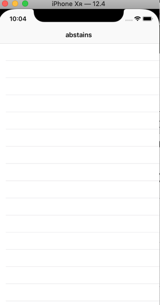
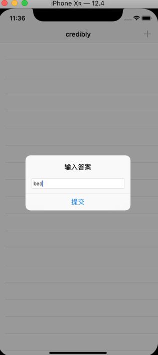

# Swift Day 27

>今天学习捕获列表和项目5的三个主题

## Swift中的捕获列表:强引用,弱引用,无主引用之间的区别

[文章](https://www.jianshu.com/p/37a62bada107)

## Setting up(创建项目)

项目1-4都很简单,因为我的目标是教你iOS开发的基础知识,同时做一些有用的东西,但是现在你要熟悉我们核心的工具,所以是会后改变去吹一些有难度的问题了

在这个项目中，你将学习如何创建一个处理字谜的文字游戏，但是按照惯例，我会利用它作为一种教你更多关于iOS开发的方法。这一次，我们将回到项目1中的表视图，但你还将学习如何从文件夹加载文本，如何在`UIAlertController`中请求用户输入，以及如何更深入地了解闭包的工作

创建一个空的应用,并修改首页为tableViewController,给首页增加导航,tableViewCell的style设置为`Basic`,标识符为`Word`.
这些内容在项目一的时候已经做过了,不在獒述,有忘记的请翻看项目一复习

## Reading from disk: contentsOf (从磁盘读取)

我们将制作一个字谜游戏，用户被要求用更多的单词来制作单词。我们将列出游戏可能的起始单词列表，该列表将存储在单独的文件中.但是我们如何从文件中获取文本到应用程序？好吧，事实证明，Swift的`String`数据类型让它变得简单

把`start.txt`拖进项目.它包含1w多单词,每行有一个单词,我们可以吧单词转换成数组储存起来使用.每一行字符串后面隐含着一个`\n`所以我们可以使用`\n`把字符串分割成单词数组

首先,返回我们的类,我们创建两个数组,一个数组储存所有的单词,另一个储存用户在游戏中使用的单词

在`ViewController.swift`中增加两个数组属性

```
var allWords = [String]()
var usedWords = [String]()
```
接下来,数组加载数据,分为三步:1.找到start.txt目录,2.加载这个文件,3.用分割字符分割成数组

为了找到文件的路径是你会做很多事情的，因为即使你知道文件名为“start.txt”，你也不知道它在文件系统中的位置。所以，我们使用Bundle的内置方法来找到它：`path(forResource :)`。这将参数作为文件的名称及其路径扩展名，并返回一个`String？` - 即，您要么返回路径，要么如果不存在则为`nil`。

将文件加载到字符串中也是你需要熟悉的东西，并且还有一种简单的方法：当您创建`String`实例时，你可以要求它根据文件的内容创建自己.

最后我们需要用`\n`分隔转化为我们的数组使用

```
if let startWordsURL = Bundle.main.url(forResource: "start", withExtension: "txt") {
    if let startWords = try? String(contentsOf: startWordsURL) {
        allWords = startWords.components(separatedBy: "\n")
    }
}
if allWords.isEmpty {
    allWords = ["silkworm"]
}
```
如果你仔细看，那里有一个新的关键词：`try?`你之前已经看过`try!`我们在这里使用它，因为我们正在从我们的应用程序包中加载一个文件，所以任何失败都可能是灾难性的。但是，这样我就有机会教你一些新东西：`try?`意思是“调用此代码，如果它抛出错误，只需发送给我nil代替。”这意味着您调用的代码将始终有效,需要小心拆包。

我还添加了一个新的有用的数组属性：`isEmpty`。如果数组为空，则返回`true`，实际上等于写`allWords.count == 0`.我们使用`isEmpty`的原因是因为某些集合类型（如`string`）必须通过计算它们包含的所有元素来计算它们的大小，因此`count== 0`可能比使用`isEmpty`慢得多。

如您所见，该代码仔细检查和解包我们的启动文件的内容，然后将其转换为数组。完成后，`allWords`将包含12,000多个字符串，供我们在游戏中使用。

为了在继续之前证明一切正常，让我们创建一个名为`startGame()`的新方法。每次我们想要为玩家生成一个新单词时都会调用它，并且它将使用Swift数组的`randomElement()`方法从所有字符串中选择一个随机项。

```
func startGame() {
    title = allWords.randomElement()
    usedWords.removeAll(keepingCapacity: true)
    tableView.reloadData()
}
```

第1行将视图控制器的标题设置为数组中的随机单词，这将是玩家必须找到的单词。

第2行从`usedWords`数组中删除所有值，到目前为止我们将使用它来存储玩家的答案。我们现在没有添加任何东西，所以`removeAll()`不会做任何事情。

第3行是有趣的部分：它调用`tableView`的`reloadData()`方法。表视图作为属性提供给我们，因为我们的ViewController类来自UITableViewController，并且调用`reloadData()`强制它再次调用`numberOfRowsInSection`，以及重复调用`cellForRowAt`。我们的表视图还没有任何行，因此暂时不会执行任何操作。但是，该方法已准备好使用，并允许我们检查我们是否正确加载了所有数据，因此在`viewDidLoad()`结束之前添加它：

```
startGame()
```


在我们完成之前，我们需要添加一些方法来处理表视图数据：`numberOfRowsInSection`和`cellForRowAt`。这些与项目1中的实现相同，除了现在我们使用`usedWords`数组和`Word`单元标识符。现在添加这两种方法：

```
override func tableView(_ tableView: UITableView, numberOfRowsInSection section: Int) -> Int {
    return usedWords.count
}
override func tableView(_ tableView: UITableView, cellForRowAt indexPath: IndexPath) -> UITableViewCell {
    let cell = tableView.dequeueReusableCell(withIdentifier: "Word", for: indexPath)
    cell.textLabel?.text = usedWords[indexPath.row]
    return cell
    
}
```

并没有任何效果,因为`userWords`数组没有变化

## Pick a word, any word: UIAlertController(选择任一单词:弹窗)

此游戏将提示用户输入可以从八个字母的提示词中输入的单词。例如，如果八个字母的单词是“agencies”，则用户可以输入“cease”。我们将用`UIAlertController`来解决这个问题，因为它很合适，也让我有机会介绍一些新的教学。

在`viewDidLoad()`增加添加barButtonItem

```
navigationItem.rightBarButtonItem = UIBarButtonItem(barButtonSystemItem: .add, target: self, action: #selector(promptForAnswer))
```
接下来实现 `promptForAnswer()`方法,弹框让用户输入单词并提交

```
@objc func promptForAnswer() {
    let ac = UIAlertController(title: "Enter answer", message: nil, preferredStyle: .alert)
    ac.addTextField()

    let submitAction = UIAlertAction(title: "Submit", style: .default) { [weak self, weak ac] action in
        guard let answer = ac?.textFields?[0].text else { return }
        self?.submit(answer)
    }

    ac.addAction(submitAction)
    present(ac, animated: true)
}
```

代码还不能运行,因为还没有实现submit()方法,我们先说说上面代码
> * 它需要从`UIBarButtonItem`动作调用，所以我们必须将它标记为`@objc`。希望你开始意识到什么时候需要它，但不要担心，如果你忘了 - 如果需要@objc而不存在，Xcode会提示！
> * 创建一个新的`UIAlertController`：我们在项目2中做到了这一点。
> *  `addTextField()`方法只是向`UIAlertController`添加了一个可编辑的文本输入字段。我们可以用它做更多的事情，但现在已经够了。
> * `addAction()` 方法用于将`UIAlertAction`添加到`UIAlertController`。我们也在项目2中使用了它。
> * `present()方法也来自项目2.
> 

`UITextField`是一个简单的可编辑文本框，显示键盘，以便用户输入内容。我们使用`addTextField()`方法向`UIAlertController`添加了一个文本字段，现在我们读出了插入的值。

接下来是尾随闭包语法。我们在学习Swift基础知识的同时介绍了这一点，但是现在你可以看到它的实际应用：我们在方法调用之后传递我们想要在大括号中运行的代码，而不是指定一个处理程序参数

接下来，`action in`。如果你还记得项目2，我们必须修改`askQuestion()`方法，以便它接受一个`UIAlertAction`参数来说明点击了什么按钮，如下所示：

```
func askQuestion(action: UIAlertAction!) {
```
我们别无选择，只能这样做，因为`UIAlertAction`的`handler`参数需要一个将自身作为参数的方法，并且我们还添加了一个默认值“nil”，因此我们可以自己调用它。这就是这里发生的事情：我们给`UIAlertAction`一些代码，当它被点击时执行，并且它想知道该代码接受`UIAlertAction`类型的参数。

`in`关键字很重要：之前的所有内容闭包描述;之后的一切都是闭包实现。因此，`action in`意味着它接受`UIAlertAction`类型中的一个参数。

在我们当前的项目中，我们可以进一步简化这一点：我们不会在闭包内部对action参数进行任何引用，这意味着我们根本不需要给它起一个名字。在Swift中，要保留一个未命名的参数，只需使用下划线字符，如下所示：
```
_ in
```

最后是`weak`之前说了闭包捕获列表中的弱引用,强引用和无主引用

避免出现循环引用,比包中捕获对象使用 `weak`



