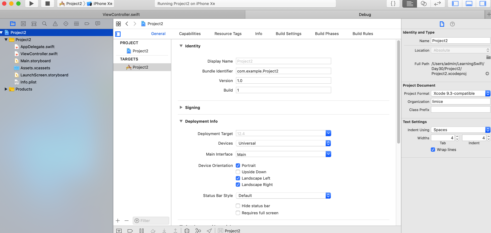
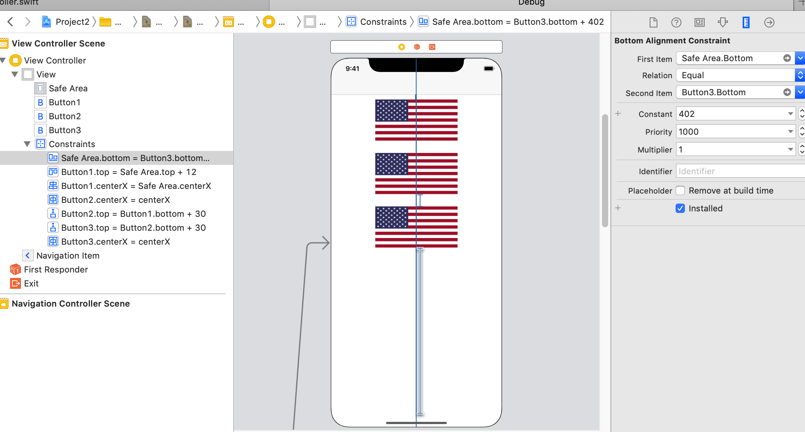

# Swift Day 30
>今天，您有三个主题需要学习，主要使用宽高比约束，可视化格式语言等。

## Setting up
在这个项目中，你将学习更多关于自动布局的知识，这是iOS让您设计布局的强大而富有表现力的方式。我们在项目2中使用它来确保我们的旗帜按钮位置正确，但该项目有问题：如果您旋转设备，旗帜没根据屏幕变化！

因此，我们首先要修复项目2，以便它演示更高级的自动布局技术（同时还使旗帜保持在屏幕上正确！），然后看看可以在代码中使用自动布局的方法。

首先：获取项目2的副本，将其命名为project6a，然后在Xcode中打开它。一切ok？然后我们开始吧
## Advanced Auto Layout
当您运行项目时，它在纵向看起来很好，但在横向上无法使用，因为某些按钮被遮挡了。您有两种选择：禁用横向模式，或使布局在两个方向上适配。

禁用方向不是一个很好的解决方案，但有时它是正确的解决方案。例如，大多数游戏都会禁用某个方向，因为支持两者都没有意义。如果你想这样做，按Cmd + 1显示Xcode窗口左侧的项目导航器，选择你的项目（这是窗格中的第一项），然后你刚刚点击的右边会出现另一个窗格显示“PROJECT”和“TARGETS”，以及中心的更多信息。

**请注意：**可以通过单击项目编辑器左上角的公开按钮（直接位于带有四个方块的图标下方）隐藏此project和target列表，您可能会发现它们已被隐藏。我强烈建议您显示此列表 - 隐藏它只会使事情更难找到，所以请确保它可见！

在下图中，您可以看到项目编辑器，底部是设备方向。这是project和target的折叠视图，因此顶部有一个下拉箭头，上面写着“Project2”（就在它上面用粗体表示身份的位置），左边是显示peoject和target列表的按钮


此视图称为项目编辑器，包含大量影响应用程序的选项。你将来会经常使用它，所以请记住如何找到这里！在TARGETS下选择Project 2，然后选择`General`选项卡，向下滚动，直到看到四个名为`Device Orientation`的复选框。您只能选择要支持的那些。

你需要在以后的某些项目中支持选择方向，但现在让我们采用智能解决方案：为自动布局添加额外规则，以便在横向模式下使布局工作得很好

在Interface Builder中打开Main.storyboard，选择底部旗帜，然后按住Ctrl键从标志拖动到标志正下方的空白区域 - 在视图控制器本身中。你拖动的方向很重要，所以请直接向下拖动。

当您释放鼠标按钮时，将出现一个弹出窗口，其中包含“Bottom Space to Safe Area”选项 - 请选择该选项。这将创建一个新的自动布局约束，标志的底部必须至少距视图控制器的底部X点，其中X等于现在的任何空间。

虽然这是一个有效的规则，但它会搞砸你的布局，因为我们现在有一套完整的精确垂直规则：顶部标志应该是从顶部12点，第二个30应该从第一个，第三个30从第二个，和第三个X远离底部。这对我来说是402，但你的可能会有所不同。

因为我们已经告诉自动布局确切地说所有空间应该有多大，所以它会将它们加起来并将剩余的空间分成三个旗帜。也就是说，现在必须垂直拉伸旗帜以填充空间，这几乎肯定是我们不想要的。

相反，我们将告诉Auto Layout哪里有一些灵活性，那就是我们刚创建的新底层规则。底部标志不需要距离安全区域底部402个点 - 它只需要距离一定距离，这样它就不会碰到边缘。如果有更多的空间，很好，自动布局应该使用它，但我们关心的是最小的。

选择第三个旗帜可以看到约束列表显示为蓝色的线，然后（小心！）选择我们刚刚添加的底部约束。在右侧的实用程序视图中，选择属性检查器（Alt + Cmd + 4），您应该看到Relation设置为Equal和Constant设置为402（或其他一些值，具体取决于你的布局）。

您需要做的是将Equal更改为“Greater Than or Equal”，然后将Constant值更改为20.这会将规则设置为“至少20，但您可以更多地填充空间”。在您执行此操作时，布局不会在视觉上发生变化，因为最终结果是相同的。但至少现在Auto Layout知道它除了伸展旗帜外还有一些灵活性！

然而，我们的问题仍然没有解决：iPhone SE只有320个空间可供使用，因此Auto Layout将通过挤压其中一个或甚至两个来使我们的旗帜适合。压扁的旗帜不好，旗帜大小不均也不好，所以我们要添加更多的规则。
选择第二个按钮，然后按住Ctrl键并拖动到第一个按钮。给定选项列表时，选择“等高”。现在从第三个按钮到第二个按钮执行相同操作。此规则确保三个标志始终具有相同的高度，因此自动布局不能再压缩一个按钮使其全部适合，而是必须平均压缩所有三个。

这解决了问题的一部分，但在某些方面它使事情变得更糟。我们现在有三个，而不是一个被压扁的旗帜！但是，再加上一条规则，我们可以阻止旗帜被压扁。选择第一个按钮，然后按住Ctrl键向上拖动一点 - 但保持在按钮内！当您松开鼠标按钮时，您将看到“Aspect Ratio”选项，因此请选择它。

纵横比约束一劳永逸地解决了挤压：这意味着如果强制自动布局减小旗帜的高度，它将以相同的比例减小其宽度，这意味着标志看起来总是正确的。将Aspect Ratio约束添加到其他两个标志，然后再次运行您的应用程序。所有这一切都归功于自动布局.
## Auto Layout in code:`addconstraints()`with visual Format Language
创建一个新项目为Project6b,我们使用手动代码添加视图,在`viewDidLoad()`中加入以下代码

```
override func viewDidLoad() {
    super.viewDidLoad()

    let label1 = UILabel()
    label1.translatesAutoresizingMaskIntoConstraints = false
    label1.backgroundColor = UIColor.red
    label1.text = "THESE"
    label1.sizeToFit()

    let label2 = UILabel()
    label2.translatesAutoresizingMaskIntoConstraints = false
    label2.backgroundColor = UIColor.cyan
    label2.text = "ARE"
    label2.sizeToFit()

    let label3 = UILabel()
    label3.translatesAutoresizingMaskIntoConstraints = false
    label3.backgroundColor = UIColor.yellow
    label3.text = "SOME"
    label3.sizeToFit()

    let label4 = UILabel()
    label4.translatesAutoresizingMaskIntoConstraints = false
    label4.backgroundColor = UIColor.green
    label4.text = "AWESOME"
    label4.sizeToFit()

    let label5 = UILabel()
    label5.translatesAutoresizingMaskIntoConstraints = false
    label5.backgroundColor = UIColor.orange
    label5.text = "LABELS"
    label5.sizeToFit()        

    view.addSubview(label1)
    view.addSubview(label2)
    view.addSubview(label3)
    view.addSubview(label4)
    view.addSubview(label5)
}
```
所有代码创建了五个`UILabel`对象，每个对象都有唯一的文本和独特的背景颜色。然后使用`view.addSubview()`将所有五个视图添加到属于我们的视图控制器的视图中。

我们还在每个label上将属性`translatesAutoresizingMaskIntoConstraints`设置为`false`，因为默认情况下iOS会根据视图的大小和位置为您生成自动布局约束。我们将手动完成，因此我们需要禁用此功能。

如果您现在运行该应用程序，您会看到顶部有一些彩色标签，重叠。这是因为我们的标签被放置在它们的默认位置（在屏幕的左上角），并且由于我们在每个标签上调用`sizeToFit()`，因此它们的大小都适合它们的内容。

我们将添加一些约束，表示每个标签应从其超视图的左边缘开始，并在右边缘结束。更重要的是，我们将使用一种称为自动布局视觉格式语言（VFL）的技术来实现这一点，这种技术有点像用一系列键盘符号绘制所需的布局。

在我们这样做之前，我们需要创建一个我们想要布局的视图字典。 VFL需要这个的原因很快就会变得清晰，但首先是你需要在最后一次调用`addSubview()`之后添加的字典：

```
let viewsDictionary = ["label1": label1, "label2": label2, "label3": label3, "label4": label4, "label5": label5]
```
这会创建一个字典，其字符串包含其键和label作为其值（值）。因此，要访问label1，我们现在可以使用`viewsDictionary [“label1”]`。这似乎是多余的，但等一会儿：是时候使用一些VFL了！

将这些代码直接添加到刚创建的viewsDictionary下面

```
view.addConstraints( NSLayoutConstraint.constraints(withVisualFormat: "H:|[label1]|", options: [], metrics: nil, views: viewsDictionary))
view.addConstraints( NSLayoutConstraint.constraints(withVisualFormat: "H:|[label2]|", options: [], metrics: nil, views: viewsDictionary))
view.addConstraints( NSLayoutConstraint.constraints(withVisualFormat: "H:|[label3]|", options: [], metrics: nil, views: viewsDictionary))
view.addConstraints( NSLayoutConstraint.constraints(withVisualFormat: "H:|[label4]|", options: [], metrics: nil, views: viewsDictionary))
view.addConstraints( NSLayoutConstraint.constraints(withVisualFormat: "H:|[label5]|", options: [], metrics: nil, views: viewsDictionary))
```
这是很多代码，但实际上它只是五次相同的事情。因此，我们可以轻松地在循环中重写它们，如下所示：

```
for label in viewsDictionary.keys {
    view.addConstraints( NSLayoutConstraint.constraints(withVisualFormat: "H:|[\(label)]|", options: [], metrics: nil, views: viewsDictionary))
}
```
>* `view.addConstraints()`：这会向视图控制器的视图添加一组约束。使用此数组而不是单个约束，因为VFL一次可以生成多个约束。 
>* `NSLayoutConstraint.constraints（withVisualFormat :)`是自动布局方法，可将VFL转换为约束数组。它接受了很多参数，但重要的是第一个和最后一个。
> * 我们为`options`参数传递[]（空数组），为`metrics`参数传递nil。您可以使用这些选项来自定义VFL的含义，但是现在我们并不关心。

那么，让我们看一下Visual Format Language本身：`“H：| [label1] |”`。正如您所看到的那样，它是一个字符串，该字符串描述了我们希望布局的外观。该VFL将转换为自动布局约束，然后添加到视图中。

`H：`部分意味着我们正在定义一个水平布局;我们很快就会进行垂直布局。符号`|`表示“视图的边缘”。我们将这些约束添加到视图控制器内的主视图中，因此这实际上意味着“视图控制器的边缘”。最后，我们有`[label1]`，这是一种说“将label1放在这里”的直观方式。想象一下，括号[和]是视图的边缘。

所以，`“H：| [label1] |”`意思是“水平，我希望我的label1在我的视图中边缘的边缘。”但是有一个疑问：什么是“label1”？当然，我们知道它是什么，因为它是变量的名称，但变量名只是人类可读和写的东西 - 变量名实际上并没有保存并在程序运行时使用。

这是我们的`viewsDictionary`字典的来源：我们使用字符串作为键，使用`UILabels`作为值，然后将`“label1”`设置为我们的标签。该词典与VFL一起传入，并被iOS用于从VFL中查找名称。因此，当它看到[label1]时，它在我们的字典中查找“label1”键并使用其值来生成自动布局约束。

这就是整个VFL线的解释：我们的每个label都应该在我们看来是边缘到边缘。如果您现在运行该程序，那就是您将看到的内容，虽然它突出了我们的第二个问题：我们没有适当的垂直布局，所以尽管所有标签在视图中都是边对边的，但它们是全部重叠。

我们将使用另一组约束修复此问题，但这次它只用一行代码

```
view.addConstraints(NSLayoutConstraint.constraints(withVisualFormat: "V:|[label1]-[label2]-[label3]-[label4]-[label5]", options: [], metrics: nil, views: viewsDictionary))
```

除了VFL部分外，这与前五个相同。这次我们指定`V :`,这意味着这些约束是垂直的。我们在VFL内部有多个视图，因此会产生很多约束。这次VFL的新事物是` - `符号，意思是“空间”。它默认为`10`，但您可以自定义它。

请注意，我们的垂直VFL最后没有`|`，所以我们不会强迫最后一个标签一直延伸到视图的边缘。这将在最后一个标签之后留下空白，这正是我们现在想要的。

如果你现在运行你的程序，你会看到所有五个标签水平边缘到边缘，然后整齐地垂直间隔。在Interface Builder中需要进行大量的Ctrl-drag来进行相同的布局，所以我希望你能体会到VFL的强大功能！