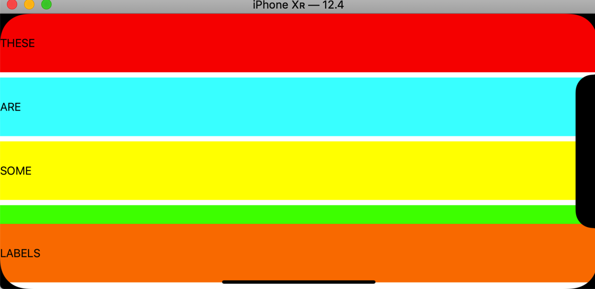

# Swift Day 31

>今天会学习VFL更高级的用法和AutoLayout锚点,并完成项目复习和三个挑战

## Auto Layout metrics and priorities: constraints(withVisualFormat:)
我们现在有一个基础的布局,`label`不是很高,如果没有最后一个label距底部的约束,可能视图会超出底边

为了解决这个问题,我们为底边增加一个约束,最后一个label的底部距视图底部最少10个点,然后每个label的高度为88,更改垂直布局

```
view.addConstraints( NSLayoutConstraint.constraints(withVisualFormat: "V:|[label1(==88)]-[label2(==88)]-[label3(==88)]-[label4(==88)]-[label5(==88)]-(>=10)-|", options: [], metrics: nil, views: viewsDictionary))
```
>(==88)表示label高度为88, (>=10)表示label距底边最小为10
如果我不想让高度为88,而是80呢,后来又改修改为60 ,72呢,你需要修改VFL里每个label的高度,这就很麻烦了,AutoLayout给出一个解决方法,称为*`metrics`* ,之前在`constraints(withVisualFormat:)`中metrics参数都被设置为nil,我们需要修改一下

```
let metrics = ["labelHeight": 88]
        
view.addConstraints(NSLayoutConstraint.constraints(withVisualFormat: "V:|[label1(labelHeight)]-[label2(labelHeight)]-[label3(labelHeight)]-[label4(labelHeight)]-[label5(labelHeight)]-(>=10)-|", options: [], metrics: metrics, views: viewsDictionary))
```
这时候你只需要修改一处就可以把所有标签高度进行变更		
现在我们的约束还有一个问题就是,当你横屏的时候,约束并不能很好的显示视图.这时候需要做一下约束的优先级,给约束一个优先级,让它更好的工作


约束优先级是介于1和1000之间的值，其中1000表示“这是绝对必需的”，任何较小的值都是可选的。默认情况下，您拥有的所有约束都是优先级1000，因此自动布局将无法在当前布局中找到解决方案。但是如果我们将高度设置为可选 - 即使高度优先级999 - 这意味着自动布局可以找到我们布局的解决方案：缩小label高度以使其适合。

重要的是要了解Auto Layout不仅会丢弃它无法满足的规则 - 它仍然会尽力满足它们。因此，在我们的情况下，如果我们将88高度设置为可选，则自动布局可能会使它们成为78或其他数字。也就是说，它仍将尽力使它们尽可能接近88。从最高优先级到最低优先级评估约束，但所有约束都被考虑在内。

因此，我们将使标签高度优先级为999（即非常重要，但不是必需的）。但我们还要进行另一项更改，即告诉Auto Layout我们希望所有标签具有相同的高度。这很重要，因为如果所有这些都使用labelHeight具有可选高度，则自动布局可以通过缩小一个label高度并且其他label为88来解决布局问题。但它使我们的用户界面看起来不均匀。因此，我们将使第一个标签使用labelHeight，优先级为999，然后让其他标签采用与第一个标签相同的高度。		
这是新的VFL代码：

```
"V:|[label1(labelHeight@999)]-[label2(label1)]-[label3(label1)]-[label4(label1)]-[label5(label1)]->=10-|"
```
## Auto Layout anchors
你已经了解了如何在Interface Builder和使用VFL创建自动布局约束，但还有一个选项可供您使用，它通常是最佳选择。

每个UIView都有一组定义其布局规则的锚点。最重要的是`widthAnchor`，`heightAnchor`，`topAnchor`，`bottomAnchor`，`leftAnchor`，`rightAnchor`，`leadingAnchor`，`trailingAnchor`，`centerXAnchor`和`centerYAnchor`。

其中大多数应该是不言自明的，但值得说明的是`leftAnchor`，`rightAnchor`，`leadingAnchor`和`trailingAnchor`之间的区别。英语，从左到右书写和阅读。left和leading是一样的,right和trailing是一样的.但是，对于从右到左的语言，例如希伯来语和阿拉伯语，leading等于right，trailing等于left。

在实践中，这意味着如果您希望用户界面翻转为从右到左的语言，则使用leadingAnchor和trailingAnchor;对于无论在什么环境下应该看起来相同的东西，使用leftAnchor和rightAnchor。

使用锚点的最佳方法是可以相对于其他锚点创建它们。也就是说，你可以说“这个label的宽度锚点等于其view的宽度”，或者“这个按钮的顶部锚点等于另一个按钮的底部锚点”。

为了压实锚点,我们注释掉VFL代码,并修改为以下代码:

```
for label in [label1, label2, label3, label4, label5] {
    label.widthAnchor.constraint(equalTo: view.widthAnchor).isActive = true
    label.heightAnchor.constraint(equalToConstant: 88).isActive = true
}
```
循环设置label的宽度跟屏幕宽相同,高度为88.但是我们还没有设置顶部锚点,所以布局还不正确,我们想要每个label的顶部锚点等于循环中的前一个label的底部锚点,第一次没有之前的label标签,所以我们可以使用可选类型设置一个中转label

```
var previous: UILabel?
```
第一次循环遍历时将为nil，但之后我们将其设置为循环中的当前项，以便下一个标签可以引用它。如果`previous`不是nil，我们将设置`topAnchor`约束。

```
var previous: UILabel?
for label in [label1, label2, label3, label4, label5] {
	label.widthAnchor.constraint(equalTo: view.widthAnchor).isActive = true
	label.heightAnchor.constraint(equalToConstant: 88).isActive = true
    
	if let previous = previous {
	    label.topAnchor.constraint(equalTo: previous.bottomAnchor, constant: 10).isActive = true
	}
	previous = label
}
```
第三个锚点将不同的锚点与常量值组合在一起以获得视图之间的间距 。

现在运行应用程序，您将看到所有标签整齐地排列在外。我希望你会同意锚点使自动布局代码非常易于阅读和编写！

锚也让我们很好地控制安全区域。 “safe area”是在iPhone X和其他此类设备的内部实际可见的空间 - 具有圆角，缺口和类似物。这是一个排除这些区域的空间，因此标签不再位于凹口或圆角下方。

我们可以使用约束来修复它。在我们当前的代码中，我们说“如果我们有一个先前的标签，那么使这个标签的顶部锚点等于前一个标签的底部锚点加上10”。但是如果我们添加一个else块，我们就可以将第一个标签推开从安全区域的顶部开始，所以它不会位于缺口之下，如下所示

```
if let previous = previous {
    // we have a previous label – create a height constraint
    label.topAnchor.constraint(equalTo: previous.bottomAnchor, constant: 10).isActive = true
} else {
    // this is the first label
    label.topAnchor.constraint(equalTo: view.safeAreaLayoutGuide.topAnchor, constant: 0).isActive = true
}
```
## Wrap up
大多数人建议你尽可能多地在Interface Builder中做，并且有充分的理由 - 你可以随意拖动线，你可以即时预览它的外观，如果出现问题它会发出警告（并帮助您修复它。）但是，正如您所见，由于VFL和锚点，在代码中创建约束非常容易，因此你可能会发现自己将它们混合在一起以获得最佳结果
## Review for Project 6: Auto Layout
[复习](https://www.hackingwithswift.com/review/hws/project-6-auto-layout)
## Challenge
1. 使用`leadingAnchor`和`trailingAnchor`约束替换label的`widthAnchor`，这些约束更明确地将标签固定到其父级的边缘。
2. 完成第一个挑战后，请尝试使用`safeAreaLayoutGuide`来解决这些问题。您可以通过旋转到横向来查看这是否有效，因为label不会进入安全区域。
3. 尝试使label的高度等于主视图的1/5，间距小于10。