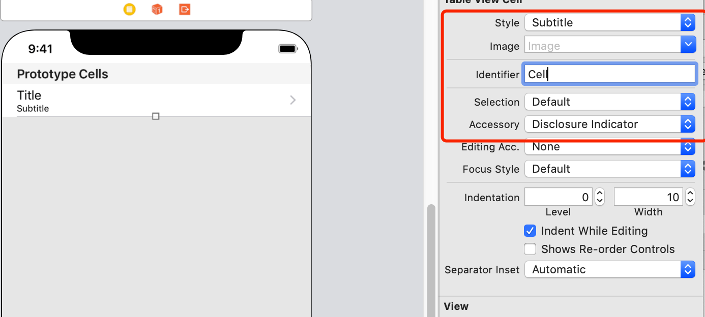
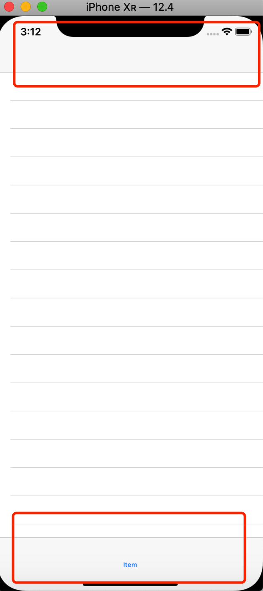
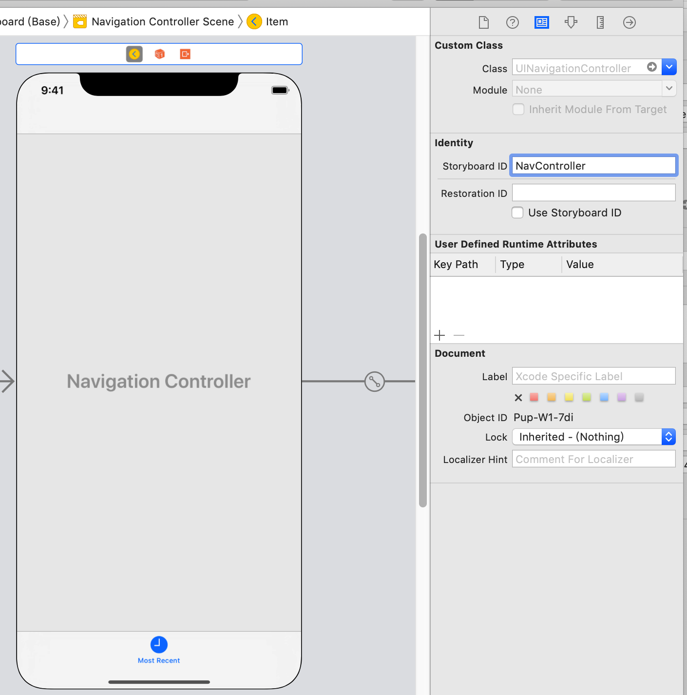

# Swift Day 33

> 今天你将会遇到Swift开发的一个真正伟大的功能，它也可能是最重要技能的一部分。该功能称为`Codable`协议，其作用是将Swift数据（如字符串，字典或结构体）转换为可通过Internet传输的数据。
> 今天又=有三个主题,你会学习`UITabBarController`,`Data`,`Codable`等等

## Setting up

这次你将学习`UITabBarController`和一种名为`JSON`的数据格式，这是一种在线发送和接收数据的流行方式。要找到免费提供的有趣的JSON供稿并不容易，但我们要选择的选项是美国的“We the people”Whitehouse请愿书，美国人可以提交行动请求，其他人可以投票。

所以让我们开始吧：通过选择Single View App模板在Xcode中创建一个新项目。现在将其命名为Project7并将其保存在某处。
## Creating the basic UI:UITabBarController
我们已经在之前的项目中使用过`UINavigationController`来提供核心用户界面，让我们可以控制当前可见的屏幕。另一个基本的UI组件是tabbar，您可以在应用程序（如App Store，音乐和照片）中看到它 - 它允许用户通过点击他们感兴趣的内容来控制他们想要查看的屏幕。

我们当前的应用程序有一个空视图控制器，但我们将使用表视图控制器，导航控制器和tabbar控制器进行混合，以便您可以看到它们如何协同工作。

首先打开`ViewController.swift`并将`ViewController`更改为继承自`UITableViewController`而不是`UIViewController`。也就是说，改变这一行

```
class ViewController: UITableViewController {
```
然后更改storyboard,删除原有控制器,拖出一个表视图控制器,并设置类为`ViewController`,并设为程序初始视图

选择其cell并使用属性检查器为其Identifier设置为“Cell”.accessory设置为“Disclosure Indicator”;style其更改为“Subtitle”，以便每行都有一个主标题标签和一个子标签。

现在为视图控制器添加导航控制器和tabbar控制器,Editor > Embed In > Navigation Controller,和Editor > Embed In > Tab Bar Controller,运行程序发现两者同时存在


`UITabBarController`管理一组视图控制器，用户可以在其中进行选择。通常在`Interface Builder`中完成大部分工作，而不是此项目中完成。我们将使用一个选项卡显示最近的请求，另一个显示流行的请求，这实际上是相同的 - 所有改变的是数据源。

在故事板中做所有事情都意味着重复复制我们的视图控制器，这是一个坏主意，所以我们只是在故事板中设计其中一个，然后使用代码创建它的副本。

现在我们的导航控制器位于tabbar控制器内部，它将在`Interface Builder`的底部获得一个灰色条带。如果现在单击它，它将选择一种称为`UITabBarItem`的新对象类型，它是用于表示选项卡栏中视图控制器的图标和文本。在属性检查器（Alt + Cmd + 4）中，将系统项从“Custom”更改为“Most Recent”。

关于`UITabBarItem`的一个重要事项是，当你设置其系统项时，它会为选项卡的标题分配一个图标和一些文本。如果你尝试将文本更改为自己的文本，该图标将被删除，需要提供自己的文本。

选择导航控制器本身（只需单击视图控制器中心的大字母中的导航控制器所在的位置），然后按Alt + Cmd + 3选择身份检查器。我们以前没有去过这里，因为它不经常使用。但是，在这里，我希望您在“Storyboard ID”右侧的文本框中输入“NavController”。我们很快就会需要它！



在`ViewController.swift`中添加tableView相关代码

```
var petitions = [String]()
    
override func viewDidLoad() {
    super.viewDidLoad()
    // Do any additional setup after loading the view.
}
override func tableView(_ tableView: UITableView, numberOfRowsInSection section: Int) -> Int {
    return petitions.count
}
override func tableView(_ tableView: UITableView, cellForRowAt indexPath: IndexPath) -> UITableViewCell {
    let cell = tableView.dequeueReusableCell(withIdentifier: "Cell", for: indexPath)
    cell.textLabel?.text = "Title"
    cell.detailTextLabel?.text = "Detail"
    return cell
}
```

## Parsing JSON using the Codable protocol
JSON - JavaScript Object Notation的缩写 - 是一种描述数据的方式。这并不是最容易阅读的，但它很紧凑，易于解析计算机，这使得它在线上流行。

在我们进行解析之前，这里是您将接收的实际JSON的一小部分

```

< Previous: Creating the basic UI: UITabBarController 	  	Next: Rendering a petition: loadHTMLString >
Parsing JSON using the Codable protocol

JSON – short for JavaScript Object Notation – is a way of describing data. It's not the easiest to read yourself, but it's compact and easy to parse for computers, which makes it popular online where bandwidth is at a premium.

Before we do the parsing, here is a tiny slice of the actual JSON you'll be receiving:

{
    "metadata":{
        "responseInfo":{
            "status":200,
            "developerMessage":"OK",
        }
    },
    "results":[
        {
            "title":"Legal immigrants should get freedom before undocumented immigrants – moral, just and fair",
            "body":"I am petitioning President Trump's Administration to take a humane view of the plight of legal immigrants. Specifically, legal immigrants in Employment Based (EB) category. I believe, such immigrants were short changed in the recently announced reforms via Executive Action (EA), which was otherwise long due and a welcome announcement.",
            "issues":[
                {
                    "id":"28",
                    "name":"Human Rights"
                },
                {
                    "id":"29",
                    "name":"Immigration"
                }
            ],
            "signatureThreshold":100000,
            "signatureCount":267,
            "signaturesNeeded":99733,
        },
        {
            "title":"National database for police shootings.",
            "body":"There is no reliable national data on how many people are shot by police officers each year. In signing this petition, I am urging the President to bring an end to this absence of visibility by creating a federally controlled, publicly accessible database of officer-involved shootings.",
            "issues":[
                {
                    "id":"28",
                    "name":"Human Rights"
                }
            ],
            "signatureThreshold":100000,
            "signatureCount":17453,
            "signaturesNeeded":82547,
        }
    ]
}
```
>1. 有一个metadata数据,包含responseInfo值,reponseInfo中有个status,status为200代表数据传输正常
>2. 有一个results值,里面是一系列数据
>3. results中每个项包含一个title,一个body,一些issues,和一些signature数据
>4. JSON有string 和integer,字符串带"",数字不带

Swift内置支持使用名为`Codable`的协议使用JSON。当“我的数据符合Codable”时，Swift将允许仅使用少量代码在该数据和JSON之间自由转换。

Swift的简单类型（如`String`和`Int`）自动遵守`Codable`，如果`Codable`包含`Codable`对象，则它们也符合`Codable`。也就是说，`[String]`符合`Codable`就好了，因为`String`本身符合`Codable`。

但是，在这里，我们需要更复杂的东西：每个results项都包含一个title，一些body，一个签名数字等等。这意味着我们需要定义一个名为`Petition`的自定义结构，它存储来自JSON的一个请求，这意味着它将跟踪标题字符串，正文字符串和签名数字。

所以Cmd+N创建Petition.swift

```
struct Petition {
    var title: String
    var body: String
    var signatureCount : Int

    
}
```
它定义了具有三个属性的自定义结构体。还记得Swift中结构体的一个优点是它为我们提供了一个成员初始化器 - 一个特殊的函数，它可以通过传入`title`，`body`和`signatureCount`的值来创建新的`Petition`实例。

我们稍后会谈到这一点，但首先我提到了`Codable`协议。我们的`Petition`结构包含两个字符串和一个整数，所有这些都符合Codable，因此我们可以让Swift使整个`Petition`类型符合Codable，如下所示：

```
struct Petition: Codable {
    var title: String
    var body: String
    var signatureCount : Int

    
}
```
如果你看一下我上面提到的JSON例子，你会注意到我们的数据实际上出现在一个叫做“results”的词典中。这意味着当我们尝试让Swift解析JSON时，我们需要首先加载该key，然后在该加载请求结果数组中。

Swift的`Codable`协议需要确切地知道在哪里找到它的数据，在这种情况下意味着制作第二个结构。这个将有一个名为`results`的属性，它将是我们的`Petition`结构的数组。这与JSON的外观完全匹配：主JSON包含`results`数组，该数组中的每个项目都是一个`petition`

新建一个`Petitions.swift`:

```
struct Petitions: Codable {
    var results: [Petition]
    
}
```
我们修改`ViewController.swift`中

```
var petitions = [String]()
```

为

```
var petitions = [Petition]()
```
现在是解析一些JSON的时候了，这意味着要处理它并检查它的内容。我们将首先更新ViewController的`viewDidLoad（）`方法，以便从Whitehouse请求服务器下载数据，将其转换为Swift `Data`对象，然后尝试将其转换为`Petition`实例数组。

我们之前没有使用过`Data`。像`String`和`Int`一样，它是Swift的基本数据类型之一，尽管它的级别更低 - 它实际上保留了任何二进制数据。它可能是一个字符串，它可能是zip文件的内容，或者字面上的任何其他内容。

`Data`和`String`有很多共同点。您已经看到可以使用`contentsOf`创建`String`以从磁盘加载数据，并且`Data`具有完全相同的初始化程序。

`viewDidLoad()`增加获取数据:

```
override func viewDidLoad() {
    super.viewDidLoad()
    // let urlString = "https://api.whitehouse.gov/v1/petitions.json?limit=100"
    let urlString = "https://www.hackingwithswift.com/samples/petitions-1.json"
    
    if let url = URL(string: urlString) {
        if let data = try? Data(contentsOf: url) {
            //可以解析
        }
    }
    // Do any additional setup after loading the view.
}
```

> * `urlString`指向Whitehouse.gov服务器或相同数据的缓存副本，访问可用的请求。
* 我们使用`if if`来确保`URL`有效，而不是强制解包它。稍后您可以返回此处以添加更多URL，因此它很安全。
* 我们使用`contentsOf`方法创建一个新的`Data`对象。这将从`URL`返回内容，但它可能会引发错误（即，如果互联网连接断开），所以我们需要使用`try？`。
* 如果`Data`对象创建成功，我们会到达“可以解析！”行。//是注释行,写一些笔记提示

这段代码并不完美，实际上远非如此。事实上，通过在`viewDidLoad()`中从互联网下载数据，我们的应用程序将锁定，直到所有数据都已传输完毕。有解决方案，但为了避免复杂性，这个项目先这样使用，直到项目9再改为其他方式。

目前，我们希望专注于我们的JSON解析。我们已经准备好接受一系列的petition数组。我们希望使用Swift的C`odable`系统将我们的JSON解析为该数组，一旦完成，就告诉我们的表视图重新加载。


```
func parse(json: Data) {
    let decoder = JSONDecoder()
    if let jsonPetitions = try? decoder.decode(Petitions.self, from: json) {
        petitions = jsonPetitions.results
        tableView.reloadData()
    }
    
}
```
>* 它创建了一个`JSONDecoder`实例，专门用于在`JSON`和`Codable`对象之间进行转换。
* 然后它调用该解码器上的`decode()`方法，要求它将我们的json数据转换为`Petitions`对象。这是一个throw调用，所以我们用`try？`检查它是否有效。
* 如果JSON已成功转换，请将结果数组分配给`petitions`属性，然后重新加载表视图。
* 你以前没见过的那一部分是`Petitions.self`，这是Swift引用Petitions类型本身的方式，而不是它的一个实例。也就是说，我们不是说“创建一个新的”，而是将其指定为解码的参数，因此`JSONDecoder`也知道要转换JSON的内容。
然后在`viewDidLoad()`里添加解析数据的方法

```
parse(json: data)
```
现在我们获得了数据,在`cellForRowAt`方法里为每一行赋值

```
let petition = petitions[indexPath.row]
cell.textLabel?.text = petition.title
cell.detailTextLabel?.text = petition.body
```

现在运行我们的程序,会发现,数据被展示在一个表视图中,一个标题和一个副标题.显示不全的会以...结尾