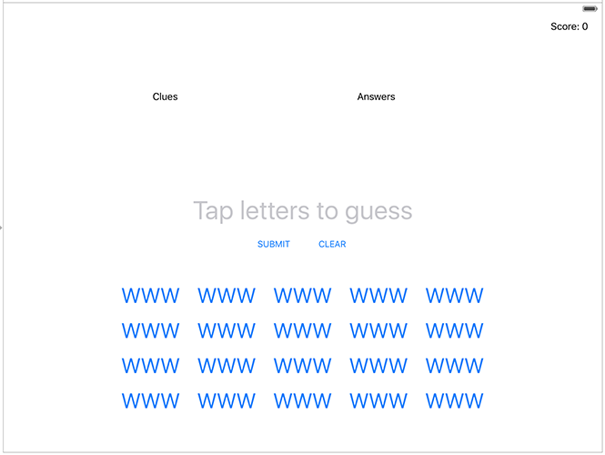

# Swift Day 36

>之前我们都是用storyboard创建我们的项目,这次我们使用代码创建,项目中仍会有一个storyboard,但是我们不使用,我们代码创建label,button,并使用AutoLayout约束;今天又两个主题,会学习到textAlignment,`layout margins` ,`UIFont`等

## Setting up
这是一个我们用`UIKit`创建的最后一个游戏应用,之后我们会使用`SpriteKit`

我们将创建一个文字游戏,用户看到提示列表和一系列字母按钮,使用按钮输入与提示匹配的单词

提前要提醒的是:虽然在代码中创建UI不难,但是确实需要花费点时间,我鼓励你定期运行代码,这样你就能看到UI真正显示的情况,以做修改调整

创建一个新的Single View App项目，命名为Project8。现在转到项目编辑器并将其设备从Universal更改为iPad,如果不知道在哪设置,请翻看project6
## Building a UIKit user interface programmatically

UI的主要部分将是两个大label：一个包含用户需要弄清楚的线索，另一个显示每个线索的单词中有多少个字母。因此，它可能会在一个标签中写出“A cow in a tornado”，而在另一个标签中可能会说“9 Letters” - 答案是“milkshake”。当玩家解决每个线索时，字母数将被替换为答案，因此他们可以一眼就看出他们已经完成

右上角增加一个额外的label,显示得分

屏幕中间是一个`UITextField`,存储用户当前的答案,它下面有两个按钮,一个提交一个清除

最后，在底部，我们将创建20个按钮，每个按钮包含线索的不同部分。因此，将有一个是MIL，一个是KSH，一个是AKE - 用户需要点击所有三个拼写MILKSHAKE。为了使我们的布局更容易，我们将把这些按钮放在另一个`UIView`中,居中显示。



首先我们在`ViewCOntroller`创建五个属性储存:clues label;answer label;用户当前答案(拼写中);用户得分label;一系列button数组

```
var cluesLabel: UILabel!
var answersLabel: UILabel!
var currentAnswer: UITextField!
var scoreLabel: UILabel!
var letterButtons = [UIButton]()
```
像项目4和项目7一样我们在自定义的`loadView()`中创建自己的用户界面;首先将主视图设置为一个白色背景的视图

```
override func loadView() {
    view = UIView()
    view.backgroundColor = .white
}
```

### 顶部三个label

接下来，让我们创建并添加分数label。这使用了与您在项目6中学到的相似的代码，尽管现在我们将设置标签的`textAlignment`属性，以使文本右对齐。在loadView()继续增加代码添加label

```
scoreLabel = UILabel()
scoreLabel.translatesAutoresizingMaskIntoConstraints = false
scoreLabel.textAlignment = .right
scoreLabel.text = "Score: 0"
view.addSubview(scoreLabel)
```
我们需要添加一些自动布局约束来使label整齐地定位在屏幕上，我们将使用锚点，就像我们在项目6中所做的那样。这些让我们非常清楚地描述性地将视图相对于彼此位置，但是这一次我想告诉你一个重要的区别：因为我们将同时创建大量约束，我们将立即激活它们，而不是多次设置`isActive = true`。

这是使用`NSLayoutConstraint.activate()`方法完成的，该方法接受一组约束。它会将它们全部放在一起，所以我们将随着时间的推移为这个调用添加更多约束。

UIKit为我们提供了几个指南，我们可以将我们的view锚定在其中。其中最常见的是我们主视图的`safeAreaLayoutGuide`，一旦你减去任何圆角或凹槽，它就是可用的空间。其中就是`layoutMarginsGuide`，它增加了一些额外的边距，使得视图不会运行到屏幕的左右边缘。

在这个应用程序中，我们将使用`layoutMarginsGuide`，以便我们的视图在每个边缘上缩进一点，但我们还将添加一些额外的缩进以使整个视图在屏幕上看起来更好。

```
NSLayoutConstraint.activate([
	scoreLabel.topAnchor.constraint(equalTo: view.layoutMarginsGuide.topAnchor),
	scoreLabel.trailingAnchor.constraint(equalTo: view.layoutMarginsGuide.trailingAnchor),
	    
])
```
`view.layoutMarginsGuide`使label和屏幕边界有一点距离

我们将在调用`NSLayoutConstraint.activate()`之前添加更多视图代码，`NSLayoutConstraint.activate()`内为视图的约束代码。

如果您现在运行该应用程序，您应该会在右上角看到“Score：0”。如果你没有看到，请检查你的代码，否则这个项目的其余部分确实会非常混乱！

接下来我们将添加clues和answer label。这将涉及与score label类似的代码，除了我们将设置两个额外的属性：`font`和`numberOfLines`。 `font`属性描述了用于呈现label的文本字体类型，并作为描述字体外观和大小的专用类型提供：`UIFont`。 `numberOfLines`是一个整数，用于设置文本可以换行的行数，但我们要将其设置为0 - 一个魔术值，表示“行数不限”。

```
cluesLabel = UILabel()
cluesLabel.translatesAutoresizingMaskIntoConstraints = false
cluesLabel.font = UIFont.systemFont(ofSize: 24)
cluesLabel.text = "CLUES"
cluesLabel.numberOfLines = 0
view.addSubview(cluesLabel)
    
answersLabel = UILabel()
answersLabel.translatesAutoresizingMaskIntoConstraints = false
answersLabel.font = UIFont.systemFont(ofSize: 24)
answersLabel.text = "ANSWERS"
answersLabel.numberOfLines = 0
answersLabel.textAlignment = .right
view.addSubview(answersLabel)
```
为了适配各个pad设备上的视图显示我们需要做一些约束:

* clues label 和answer label 固定在score label 的下面
* clues label距离屏幕leading边缘,缩进100
* clues label 的宽度设置为主视图的0.6,并减去100计算缩进
* answer label 距离屏幕trailing边缘,缩进100
* answer label 的宽度设置为主视图的0.4,并计算100的缩进
* 最后answer label 的高度和 clues label 的高度相同

将这些约束增加到activate数组中

```
            cluesLabel.topAnchor.constraint(equalTo: scoreLabel.bottomAnchor),
            
            cluesLabel.leadingAnchor.constraint(equalTo: view.layoutMarginsGuide.leadingAnchor, constant: 100),
            
            cluesLabel.widthAnchor.constraint(equalTo: view.layoutMarginsGuide.widthAnchor, multiplier: 0.6, constant: -100),
            
            answersLabel.topAnchor.constraint(equalTo: scoreLabel.bottomAnchor),
            
            answersLabel.trailingAnchor.constraint(equalTo: view.layoutMarginsGuide.trailingAnchor, constant: -100),
            
            answersLabel.widthAnchor.constraint(equalTo: view.layoutMarginsGuide.widthAnchor, multiplier: 0.4, constant: -100),
            
            answersLabel.heightAnchor.constraint(equalTo: cluesLabel.heightAnchor),
```
运行你会发现"CLUES"和"ANSWER"在屏幕上
为了使视图更直观看到约束效果,可以在`activateConstraints()`加上

```
cluesLabel.backgroundColor = .red
answersLabel.backgroundColor = .blue
```
看看效果;

### 输入答案textField
接下来我们将添加一个`UITextField`，它将在构建用户时显示用户的答案。你可能认为这是使用另一个`UILabel`的地方，特别是因为我们希望玩家通过点击字母按钮而不是输入框来构建单词。但是，这让我向你介绍文本字段的占位符属性，该属性绘制用户可以键入的灰色提示文本 - 它看起来非常好，并为我们提供了向用户提供一些指示的空间。

与我们的label一样，我们也会调整文本字段的字体和对齐方式，但我们也会禁用用户交互，因此用户无法点击它 - 我们不希望iOS键盘出现。

```
currentAnswer = UITextField()
currentAnswer.translatesAutoresizingMaskIntoConstraints = false
currentAnswer.placeholder = "Tap letters to guess"
currentAnswer.textAlignment = .center
currentAnswer.font = UIFont.systemFont(ofSize: 44)
currentAnswer.isUserInteractionEnabled = false
view.addSubview(currentAnswer)
```
将`isUserInteractionEnabled`设置为`false`，这是阻止用户激活textField并输入内容。

至于约束，我们将使这个文本字段在我们的视图中居中，但只有50％的宽度 - 考虑到它将保持多少个字符，这已经足够了。我们还将它放在clues label下面，有20个间距。

下面创建两个button,一个提交,一个清除

```
let submit = UIButton(type: .system)
submit.translatesAutoresizingMaskIntoConstraints = false
submit.setTitle("SUBMIT", for: .normal)
view.addSubview(submit)

let clear = UIButton(type: .system)
clear.translatesAutoresizingMaskIntoConstraints = false
clear.setTitle("CLEAR", for: .normal)
view.addSubview(clear)
```
**注意：**我们不需要将它们作为属性存储在视图控制器上，因为我们以后不需要调整它们。

按钮需要增加约束:		
1. 一个设置他们的垂直位置。对于提交按钮，我们将使用当前答案文本字段的底部，但是对于清除按钮，我们将设置其Y锚点，使其保持与提交按钮的Y位置对齐。这意味着即使我们移动按钮，两个按钮也将保持对齐。		
2. 我们将在主视图中将它们水平居中。要阻止它们重叠，我们将从提交按钮的X位置减去100，并将100添加到清除按钮的X位置。 “100”不是任何特殊数字 - 你可以尝试不同的值，看看有什么变化。
3. 我们要强制两个按钮的高度为44点。 iOS默认情况下喜欢使其按钮非常小，但同时Apple的人机界面指南推荐按钮至少为44x44，因此可以轻松点击它们。

```
submit.topAnchor.constraint(equalTo: currentAnswer.bottomAnchor),
submit.centerXAnchor.constraint(equalTo: view.centerXAnchor, constant: -100),
submit.heightAnchor.constraint(equalToConstant: 44),

clear.centerXAnchor.constraint(equalTo: view.centerXAnchor, constant: 100),
clear.centerYAnchor.constraint(equalTo: submit.centerYAnchor),
clear.heightAnchor.constraint(equalToConstant: 44),
```
剩下的就是在用户界面的底部添加字母按钮。我们需要很多按钮 - 准确地说是20 - 我们需要确保它们整齐地放在屏幕上。

对于像这样的复杂布局，聪明的做法是将容器包装在容器视图中。在我们的例子中，这意味着我们将创建一个容纳所有按钮的容器视图，然后给出该视图约束，以便它在屏幕上正确定位。

这只是一个简单的UIView - 它除了托管我们的按钮之外没什么特别的。因此，请在我们之前的视图创建代码下面添加此代码:

```
let buttonsView = UIView()
buttonsView.translatesAutoresizingMaskIntoConstraints = false
view.addSubview(buttonsView)
```
>我们将给它一个750x320的宽度和高度，以便它精确地包含它内部的按钮。	
>它将水平居中。		
>我们将其顶部锚点设置为提交按钮的底部，加上20个点以添加一点间距。		
>距离视图底部20，这样它就不会运行到边缘。


```
buttonsView.widthAnchor.constraint(equalToConstant: 750),
buttonsView.heightAnchor.constraint(equalToConstant: 320),
buttonsView.centerXAnchor.constraint(equalTo: view.centerXAnchor),
buttonsView.topAnchor.constraint(equalTo: submit.bottomAnchor, constant: 20),
buttonsView.bottomAnchor.constraint(equalTo: view.layoutMarginsGuide.bottomAnchor, constant: -20)
```
我们可以设置`bottonsView`的`backgroundColor`看效果

下载运行程序会发现我们的布局发生了很大的变化,原先在上面的控件都被拉下来了

这是因为我们的按钮视图在底部固定320,score label固定在顶部,中间视图相互约束

在我们添加最终按钮视图之前，自动布局并没有特别了解任何视图应该有多大，因此它使用了一种称为内在内容大小的东西 - 每个视图需要多大才能显示其内容。这导致我们的观点整齐地排列在顶部。但是现在我们有一个完整的垂直堆栈，固定在顶部和底部，因此UIKit需要通过拉伸一个或多个视图来填充其间的空间。

我们所有UIKit布局中的每个视图都有两个重要的属性告诉UIKit如何压缩或拉伸它们以满足约束：

* **Content hugging priority**:该优先级表示一个控件抗被拉伸的优先级。优先级越高，越不容易被拉伸，默认是250
* **Content compression resistance priority**:该优先级和上面那个优先级相对应，表示一个控件抗压缩的优先级。优先级越高，越不容易被压缩，默认是750

我们将调整clues label 和answer label的 Content hugging priority

```
cluesLabel.setContentHuggingPriority(UILayoutPriority(1), for: .vertical)
answersLabel.setContentHuggingPriority(UILayoutPriority(1), for: .vertical)
```

现在运行应用程序，你会发现一个很大的不同：两个label现在占用更多的空间，我们的用户界面的其余部分看起来更正常

我们有20个按钮可以创建四行和五列，这是使用一些嵌套循环的最佳时机：创建和配置每个按钮，然后将其放在buttonsView中。

但是，我们将依靠Auto Layout的一个功能来使整个过程变得更加容易：我们不会将这些按钮的`translatesAutoresizingMaskIntoConstraints`设置为`false`，这意味着我们可以为它们提供特定的位置和大小

```
// set some values for the width and height of each button
let width = 150
let height = 80

// create 20 buttons as a 4x5 grid
for row in 0..<4 {
    for col in 0..<5 {
        // create a new button and give it a big font size
        let letterButton = UIButton(type: .system)
        letterButton.titleLabel?.font = UIFont.systemFont(ofSize: 36)

        // give the button some temporary text so we can see it on-screen
        letterButton.setTitle("WWW", for: .normal)

        // calculate the frame of this button using its column and row
        let frame = CGRect(x: col * width, y: row * height, width: width, height: height)
        letterButton.frame = frame

        // add it to the buttons view
        buttonsView.addSubview(letterButton)

        // and also to our letterButtons array
        letterButtons.append(letterButton)
    }
}
```

运行程序查看效果.