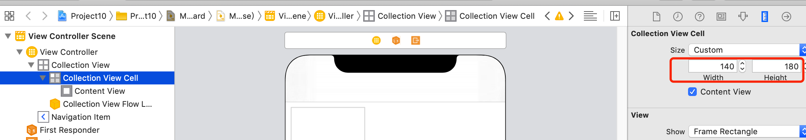
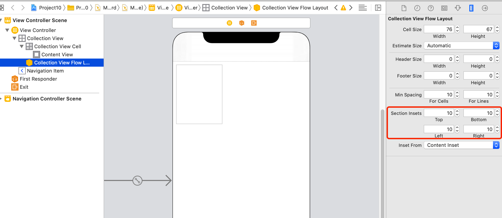
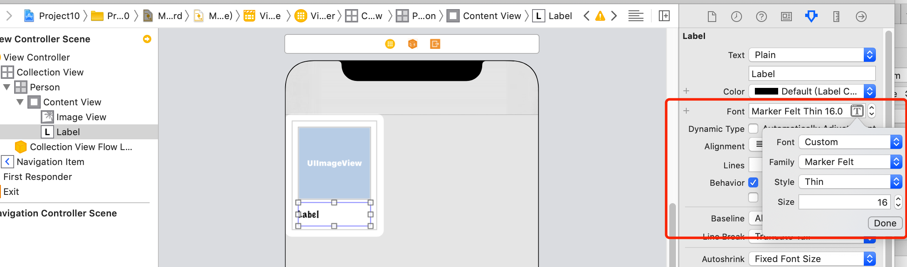
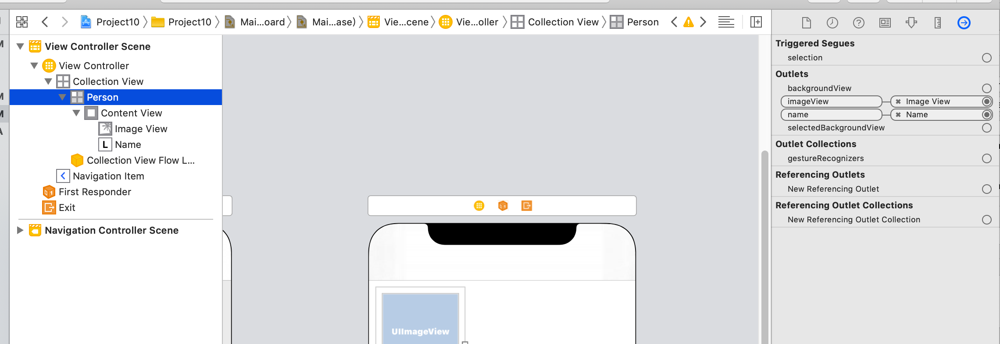
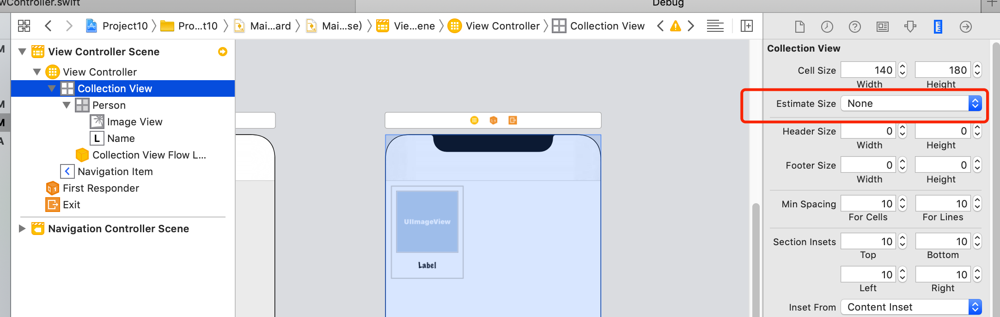
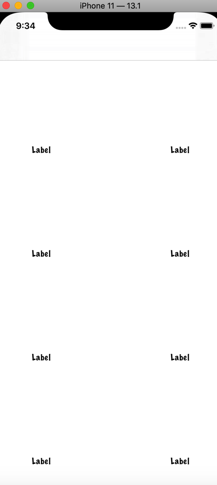

# Swift Day 42
>今天你会面临三个主题,你会学习到`UICollectionView` 和`UICollectionViewCell`

## Setting up
这是一个有趣,简单实用的项目,你可以创建一个应用程序存储你遇到的人的姓名.如果你是一个经常旅行的人,或者根据人的面孔叫出名字很困难,这个项目很适合你

这次你会学习到`UICollectionViewController`,`UIImagePickerController`,`Data`和`UUID`,另外还有之前学的`CALayer`,`UIAlertController`和闭包,更重要的是,你会学到如何创建一个新的数据类型

创建一个Single View App ,起名 Project 10
## Designing UICollectionView cells
我们使用了`UITableViewController`,但是这一次我们使用`UICollectionViewController`代替;使用起来比较类似,首先打开`ViewController.swift`使控制器继承改变为`UICollectionViewController `

```
class ViewController: UIViewController {
```

改变为:

```
class ViewController: UICollectionViewController {
```

现在打开`Main.storyboard`删除原来的viewController,然后拖一个collectionViewController,并增加导航控制器,设为初始控制器,改变类名为`ViewController`;

选择collectionView设置cell的大小为宽140,高180,设置`section insets`,上下左右都是10;



collectionView和tableView非常相像,不同的是collectionView展示网格而不是简单的行,但是底层的方法调用时相似的,所以你可以轻松学习使用

现在在cell里增加子视图,首先设置`Background`从Default变为White并设置标识为`Person`,放一个`UIImageView`(x:10,y:10,width:120,height:120)用来展示用户图像,放一个`UILabel`(x:10,y:134,width:120,height:40),设置label的font为`Custom`,family为`Market Felt`,style为`Thin`,大小为16,并设置居中,行数为2;


这是很平常的storyboard操作,但现在我们要做一下改变,我们为cell创建一个自定义类,我们需要这样做是因为,我们的cell中有一个imageView和label,我们需要对他们进行操作;

->File>New > File >iOS > Source > Cocoa Touch Class 点击下一步,类继承自`UICollectionViewCell`,类名为`PersonCell`,创建完成以后添加两个来自IB属性,表示imageView和label

```
@IBOutlet var imageView: UIImageView!
@IBOutlet var name: UILabel!
```
现在回到storyboard设置cell的类名为`PersonCell`

此时,imageView和label还没有与类中属性关联,我们需要把他们关联起来,点击链接检查器(Alt+Cmd+6),将视图与属性连接起来


## UICollectionView data sources
现在我们的视图基本好了,但现在还没数据,要想实现基本的显示跟tableview类似,但这里有一个小问题,当我们使用`dequeueReusableCell(withReuseIdentifier:for:)`;返回的是`UICollectionViewCell`而不是`PersonCell`;

我们可以增加条件类型转换解决这个问题,但是如果类型转换失败我们怎么办?我们期望得到一个`PersonCell`,实际返回一个常规的`UICollectionViewCell`,发生这种情况说明我们程序中的某个环节出了错误,所以此时我们应该跳出来,因为继续执行并没有任何意义

因此，我们将使用一个名为`fatalError()`的新函数。调用此命令将无条件使您的应用程序崩溃–它将立即死亡，并打印出你提供给它的所有消息;听起来很糟糕但是:

1.这种情况只有出现严重问题,你又不想继续时才会发生

2.Swift知道`fatalError()`总是会导致崩溃，因此我们可以使用它来逃避具有返回值的方法，而无需将任何内容发回。这使得在我们目前的情况下使用起来非常方便。

```
override func collectionView(_ collectionView: UICollectionView, numberOfItemsInSection section: Int) -> Int {
    return 10
}

override func collectionView(_ collectionView: UICollectionView, cellForItemAt indexPath: IndexPath) -> UICollectionViewCell {
    guard let cell = collectionView.dequeueReusableCell(withReuseIdentifier: "Person", for: indexPath) as? PersonCell else {
        // we failed to get a PersonCell – bail out!
        fatalError("Unable to dequeue PersonCell.")
    }

    // if we're still here it means we got a PersonCell, so we can return it
    return cell
}
```

>* `collectionView(_：numberOfItemsInSection :)`这必须返回一个整数，并告诉集合视图要在其网格中显示多少个项目。我从该方法返回了10，但是很快我们将使用一个数组个数代替。
>* `collectionView(_：cellForItemAt :)`这必须返回`UICollectionViewCell`类型的对象。我们已经在Interface Builder中设计了一个原型，并为其配置了`PersonCell`类，因此我们需要创建并返回其中一个。

>* `dequeueReusableCell(withReuseIdentifier：for :)`这将使用我们指定的重用（在本例中为“ Person”）创建一个收集视图单元，因为这是我们之前在Interface Builder中键入的内容。但是，就像表视图一样，此方法将自动尝试重用集合视图单元格，因此，只要单元格滚动出视图，就可以回收它，这样我们就不必继续创建新的单元格。


运行程序发现页面什么都没有,什么情况❓
找来找去发现Estimate size属性默认为automatic需要改为None


此时运行效果如下:




